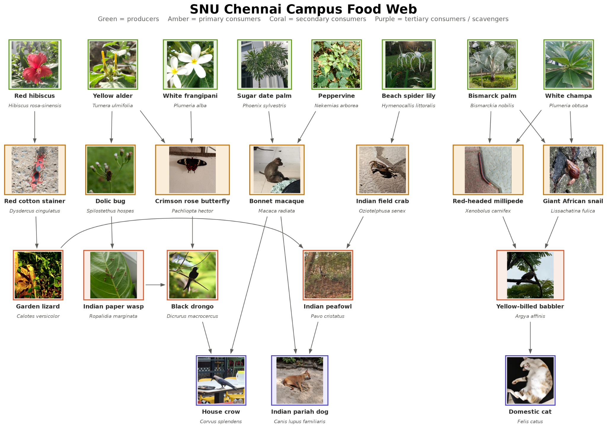
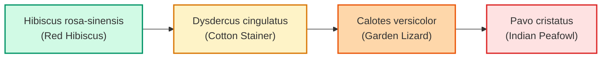

# 🕸️ Campus Ecosystem Food Chains & Trophic Web Analysis

> **Department of Environmental Science & Engineering (EVS)**  
> **Shiv Nadar University Chennai (SNU Chennai)**

---

## 1. Ecological Overview

The Shiv Nadar University Chennai campus ecosystem functions through a structured multi-tier flow of energy. Primary producers harvest sunlight to generate biomass, which sustains invertebrate herbivores and detritivores, insectivores, reptilian ambush hunters, predatory raptors, and apex mammals.

---

## 2. Campus Ecosystem Food Web Diagram

  

---

## 3. Trophic Level Stratification

### 🌞 Trophic Level 1: Primary Producers (Autotrophs)
- **Species**: *Plumeria obtusa*, *Plumeria alba*, *Plumeria rubra*, *Hibiscus rosa-sinensis*, *Nekemias arborea*, *Bismarckia nobilis*, *Rhapis excelsa*, *Phoenix sylvestris*, *Allamanda cathartica*, *Turnera ulmifolia*, *Hymenocallis littoralis*.
- **Role**: Foundational autotrophic solar energy conversion; microhabitat provision; nectar, seed, and foliar forage.

### 🐛 Trophic Level 2: Primary Consumers (Herbivores, Detritivores & Decomposers)
- **Herbivorous Invertebrates**: *Dysdercus cingulatus* (Red Cotton Stainer), *Spilostethus hospes* (Dolic Bug), *Pachliopta hector* larvae (Crimson Rose Butterfly).
- **Detritivores & Decomposers**: *Xenobolus carnifex* (Red-Headed Millipede), *Lissachatina fulica* (Giant African Snail), *Oziotelphusa senex* (Indian Field Crab).
- **Frugivorous Primates**: *Macaca radiata* (Bonnet Macaque - canopy fruits/seeds).

### 🦎 Trophic Level 3: Secondary Consumers (Carnivores, Insectivores & Small Omnivores)
- **Predators & Insectivores**: *Calotes versicolor* (Oriental Garden Lizard), *Ropalidia marginata* (Indian Paper Wasp), *Dicrurus macrocercus* (Black Drongo), *Argya affinis* (Yellow-billed Babbler), *Pavo cristatus* (Indian Peafowl).

### 🦅 Trophic Level 4: Tertiary Consumers, Apex Predators & Scavengers
- **Top Scavengers & Carnivores**: *Felis catus* (Domestic Cat), *Canis lupus familiaris* (Indian Pariah Dog), *Corvus splendens* (House Crow), *Pavo cristatus* (Apex predator of small reptiles/snakes).

---

## 4. Documented Food Chains (Energy Transfer Pathways)

### Chain 1: Terrestrial Grazing & Predator Pathway
$$	ext{Hibiscus rosa-sinensis} \longrightarrow 	ext{Dysdercus cingulatus} \longrightarrow 	ext{Calotes versicolor} \longrightarrow 	ext{Pavo cristatus}$$

### Chain 2: Nectar-Pollinator & Aerial Hawking Pathway
$$	ext{Plumeria alba / Turnera ulmifolia (Nectar)} \longrightarrow 	ext{Pachliopta hector} \longrightarrow 	ext{Dicrurus macrocercus} \longrightarrow 	ext{Corvus splendens}$$

### Chain 3: Detrital & Soil Decomposition Pathway
$$	ext{Leaf Litter (Bismarckia / Plumeria)} \longrightarrow 	ext{Xenobolus carnifex & Lissachatina fulica} \longrightarrow 	ext{Argya affinis} \longrightarrow 	ext{Felis catus}$$

### Chain 4: Wetland / Moist Margin Pathway
$$	ext{Hymenocallis littoralis (Detritus)} \longrightarrow 	ext{Oziotelphusa senex (Field Crab)} \longrightarrow 	ext{Pavo cristatus} \longrightarrow 	ext{Canis lupus familiaris}$$

### Chain 5: Frugivore-Primate Canopy Pathway
$$	ext{Phoenix sylvestris & Nekemias arborea (Berries/Drupes)} \longrightarrow 	ext{Macaca radiata} \longrightarrow 	ext{Corvus splendens & Canis lupus familiaris}$$

### Chain 6: Biological Pest Control Pathway
$$	ext{Turnera ulmifolia (Weeds/Seeds)} \longrightarrow 	ext{Spilostethus hospes (Bug)} \longrightarrow 	ext{Ropalidia marginata (Paper Wasp)} \longrightarrow 	ext{Dicrurus macrocercus}$$

---

## 5. Food Web Synthesis & Ecological Interactions Table

| Species Guild | Trophic Role | Ecological Significance | Key Interactions |
| :--- | :--- | :--- | :--- |
| **Flora (11 Species)** | Primary Producers | Foundational energy source; nectar, seeds, shade, microhabitats | Absorbs solar energy, fixes carbon, provides floral nectar |
| **Invertebrates & Crustaceans** | Primary Consumers / Decomposers | Nutrient cycling, soil aeration, pollination, detritus breakdown | Converts plant biomass; prey base for insectivores |
| **Reptiles & Insectivorous Birds** | Secondary Consumers | Biological pest control; insect population regulation | Controls caterpillars, bugs, wasps, and beetles |
| **Mammals, Scavengers & Apex Birds** | Tertiary Consumers / Scavengers | Seed dispersal, organic waste removal, campus ecosystem balance | Regulates rodent numbers, cleans organic detritus |

---

[🏠 Back to Root Repository Index](../README.md) | [🌿 Explore Flora](../Flora/README.md) | [🐾 Explore Fauna](../Fauna/README.md)
