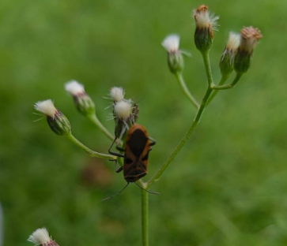

# Dolic Bug / Ground Bug (Milkweed Bug) (`Spilostethus hospes`)

| Taxonomic Field | Zoological & Ecological Specification |
| :--- | :--- |
| **Catalog ID** | `FA-01` |
| **Common Name** | Dolic Bug / Ground Bug (Milkweed Bug) |
| **Scientific Name** | *Spilostethus hospes* |
| **Family** | `Lygaeidae` |
| **Order / Class** | `Hemiptera (True Bugs)` |
| **Category** | Insect (True Bug / Hemiptera) |
| **Taxonomic Guild** | **Insects / Arthropods** |
| **Location of Observation** | **Pathway behind Dhanyas** |
| **Microhabitat** | Ground herbaceous layer & seed pods |
| **Trophic Guild** | Primary Consumer / Herbivore (Trophic Level 2) |
| **Survey Source** | Survey Specimen 13 |

---

## Field Observation Photograph

  

---

## Zoological Description & Natural History

Seed bug displaying high-contrast crimson and black geometric markings. Feeds selectively on seed fluids and serves as prey for specialized predators.

---

## Ecological Significance & Trophic Connections

- **Trophic Role**: Primary Consumer / Herbivore (Trophic Level 2)
- **Ecosystem Service / Ecological Function**: Red and black aposematic (warning) coloration signaling distastefulness to predators. Feeds on plant seeds and sap across composite weeds.
- **Position in Food Web**:
  - Serves as an active biological component in regulating campus species populations, nutrient recycling, and cross-trophic energy flow.

---

[⬅ Back to Fauna Index](../README.md) | [🏠 Back to Campus Inventory Root](../../README.md)
