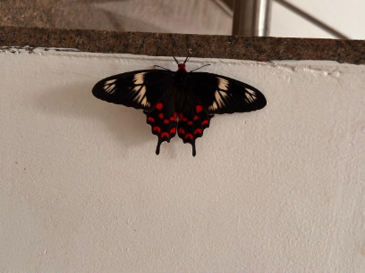

# Crimson Rose Butterfly (`Pachliopta hector`)

| Taxonomic Field | Zoological & Ecological Specification |
| :--- | :--- |
| **Catalog ID** | `FA-02` |
| **Common Name** | Crimson Rose Butterfly |
| **Scientific Name** | *Pachliopta hector* |
| **Family** | `Papilionidae` |
| **Order / Class** | `Lepidoptera (Butterflies & Moths)` |
| **Category** | Insect (Swallowtail Butterfly / Lepidoptera) |
| **Taxonomic Guild** | **Insects / Arthropods** |
| **Location of Observation** | **Ladies Hostel** |
| **Microhabitat** | Terrestrial & Aerial (Flowering gardens) |
| **Trophic Guild** | Primary Consumer / Herbivore (Trophic Level 2) |
| **Conservation / Legal Status** | **Schedule I Protected (Wildlife Protection Act, India) - Endemic to South Asia** |
| **Survey Source** | Survey Specimen 14 |

---

## Field Observation Photograph

  

---

## Zoological Description & Natural History

Large, breathtaking swallowtail butterfly with velvety-black forewings crossed by white bands and brilliant crimson-red spots along the scalloped margin of hindwings. Pollinates diverse flowering flora.

---

## Ecological Significance & Trophic Connections

- **Trophic Role**: Primary Consumer / Herbivore (Trophic Level 2)
- **Ecosystem Service / Ecological Function**: Schedule I protected species endemic to South Asia. Striking black swallowtail with prominent crimson-red crescent spots on hindwings. Vital pollinator.
- **Position in Food Web**:
  - Serves as an active biological component in regulating campus species populations, nutrient recycling, and cross-trophic energy flow.

---

[⬅ Back to Fauna Index](../README.md) | [🏠 Back to Campus Inventory Root](../../README.md)
