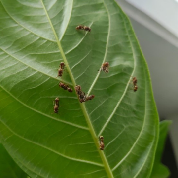

# Indian Paper Wasp / Yellow Paper Wasp (`Ropalidia marginata`)

| Taxonomic Field | Zoological & Ecological Specification |
| :--- | :--- |
| **Catalog ID** | `FA-03` |
| **Common Name** | Indian Paper Wasp / Yellow Paper Wasp |
| **Scientific Name** | *Ropalidia marginata* |
| **Family** | `Vespidae` |
| **Order / Class** | `Hymenoptera (Wasps, Bees, Ants)` |
| **Category** | Insect (Social Wasp / Hymenoptera) |
| **Taxonomic Guild** | **Insects / Arthropods** |
| **Location of Observation** | **AB3** |
| **Microhabitat** | Terrestrial & Arboreal (Under leaf surfaces, building eaves) |
| **Trophic Guild** | Secondary Consumer / Insectivore (Trophic Level 3) |
| **Survey Source** | Survey Specimen 15 |

---

## Field Observation Photograph

  

---

## Zoological Description & Natural History

Slender brownish-yellow social wasp renowned as a model organism in sociobiology. Workers forage tirelessly for caterpillars and insect larvae to feed developing broods, providing biocontrol.

---

## Ecological Significance & Trophic Connections

- **Trophic Role**: Secondary Consumer / Insectivore (Trophic Level 3)
- **Ecosystem Service / Ecological Function**: Primitively eusocial wasp constructing small open paper comb nests. Essential natural pest control agent preying on garden caterpillars and insect larvae.
- **Position in Food Web**:
  - Serves as an active biological component in regulating campus species populations, nutrient recycling, and cross-trophic energy flow.

---

[⬅ Back to Fauna Index](../README.md) | [🏠 Back to Campus Inventory Root](../../README.md)
