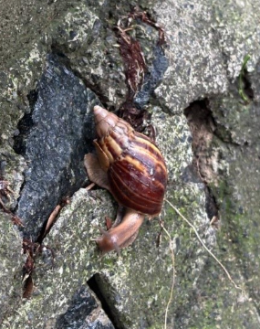

# Giant African Snail (`Lissachatina fulica (syn. Achatina fulica)`)

| Taxonomic Field | Zoological & Ecological Specification |
| :--- | :--- |
| **Catalog ID** | `FA-04` |
| **Common Name** | Giant African Snail |
| **Scientific Name** | *Lissachatina fulica (syn. Achatina fulica)* |
| **Family** | `Achatinidae` |
| **Order / Class** | `Stylommatophora (Land Snails)` |
| **Category** | Mollusc (Terrestrial Gastropod / Achatinidae) |
| **Taxonomic Guild** | **Molluscs** |
| **Location of Observation** | **Pathway behind Dhanyas** |
| **Microhabitat** | Moist soil litter & shaded garden beds |
| **Trophic Guild** | Primary Consumer / Detritivore & Decomposer (Trophic Level 2) |
| **Survey Source** | Survey Specimen 16 |

---

## Field Observation Photograph

  

---

## Zoological Description & Natural History

Massive terrestrial pulmonate gastropod with a tall, conical brown and yellow variegated shell. Feeds voraciously on decaying vegetation, recycling organic matter into soil humus.

---

## Ecological Significance & Trophic Connections

- **Trophic Role**: Primary Consumer / Detritivore & Decomposer (Trophic Level 2)
- **Ecosystem Service / Ecological Function**: Large herbivorous land snail with conical banded shell. Acts as a decomposer of decaying plant matter, active predominantly during humid/monsoon conditions.
- **Position in Food Web**:
  - Serves as an active biological component in regulating campus species populations, nutrient recycling, and cross-trophic energy flow.

---

[⬅ Back to Fauna Index](../README.md) | [🏠 Back to Campus Inventory Root](../../README.md)
