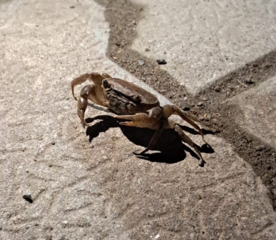

# Indian Freshwater / Field Crab (`Oziotelphusa senex`)

| Taxonomic Field | Zoological & Ecological Specification |
| :--- | :--- |
| **Catalog ID** | `FA-05` |
| **Common Name** | Indian Freshwater / Field Crab |
| **Scientific Name** | *Oziotelphusa senex* |
| **Family** | `Gecarcinucidae` |
| **Order / Class** | `Decapoda (Crabs, Shrimps)` |
| **Category** | Crustacean (Decapoda / Freshwater Crab) |
| **Taxonomic Guild** | **Crustaceans** |
| **Location of Observation** | **Pathway behind Dhanyas** |
| **Microhabitat** | Wetland margins, moist earthen burrows, seasonal puddles |
| **Trophic Guild** | Primary/Secondary Consumer & Detritivore (Trophic Level 2-3) |
| **Survey Source** | Survey Specimen 17 |

---

## Field Observation Photograph

  

---

## Zoological Description & Natural History

Semi-terrestrial freshwater burrowing crab with dark brownish carapace and adapted chelae for digging. Deep burrows aerate soil and provide vital prey for larger wading birds and mammals.

---

## Ecological Significance & Trophic Connections

- **Trophic Role**: Primary/Secondary Consumer & Detritivore (Trophic Level 2-3)
- **Ecosystem Service / Ecological Function**: Burrowing freshwater crab active during night and rainy periods. Plays a critical role in nutrient cycling and soil aeration in campus wetland margins.
- **Position in Food Web**:
  - Serves as an active biological component in regulating campus species populations, nutrient recycling, and cross-trophic energy flow.

---

[⬅ Back to Fauna Index](../README.md) | [🏠 Back to Campus Inventory Root](../../README.md)
