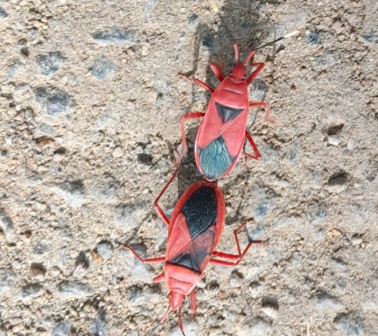

# Red Cotton Stainer (`Dysdercus cingulatus`)

| Taxonomic Field | Zoological & Ecological Specification |
| :--- | :--- |
| **Catalog ID** | `FA-06` |
| **Common Name** | Red Cotton Stainer |
| **Scientific Name** | *Dysdercus cingulatus* |
| **Family** | `Pyrrhocoridae` |
| **Order / Class** | `Hemiptera (True Bugs)` |
| **Category** | Insect (True Bug / Hemiptera) |
| **Taxonomic Guild** | **Insects / Arthropods** |
| **Location of Observation** | **Pathway behind Dhanyas** |
| **Microhabitat** | Foliage, flowers, and ground litter of Malvaceae plants |
| **Trophic Guild** | Primary Consumer / Herbivore (Trophic Level 2) |
| **Survey Source** | Survey Specimen 18 |

---

## Field Observation Photograph

  

---

## Zoological Description & Natural History

Vibrantly colored hemipteran bug with bright red body, white transverse abdominal bands, and black markings on hemelytra. Often seen gregariously feeding on hibiscus flower buds and seeds.

---

## Ecological Significance & Trophic Connections

- **Trophic Role**: Primary Consumer / Herbivore (Trophic Level 2)
- **Ecosystem Service / Ecological Function**: Phytophagous bug with bright crimson body and black dorsal patches. Frequently observed in mating pairs (tail-to-tail copulation) on ground and foliage.
- **Position in Food Web**:
  - Serves as an active biological component in regulating campus species populations, nutrient recycling, and cross-trophic energy flow.

---

[⬅ Back to Fauna Index](../README.md) | [🏠 Back to Campus Inventory Root](../../README.md)
