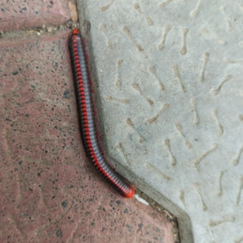

# Red-Headed / Banded Millipede (`Xenobolus carnifex`)

| Taxonomic Field | Zoological & Ecological Specification |
| :--- | :--- |
| **Catalog ID** | `FA-07` |
| **Common Name** | Red-Headed / Banded Millipede |
| **Scientific Name** | *Xenobolus carnifex* |
| **Family** | `Pachybolidae` |
| **Order / Class** | `Spirobolida (Round-backed Millipedes)` |
| **Category** | Myriapod (Diplopoda / Arthropod) |
| **Taxonomic Guild** | **Myriapods / Arthropods** |
| **Location of Observation** | **Pathway to Rishabhs** |
| **Microhabitat** | Leaf litter, decaying logs, moist soil humus |
| **Trophic Guild** | Primary Consumer / Primary Detritivore (Trophic Level 2) |
| **Survey Source** | Survey Specimen 19 |

---

## Field Observation Photograph

  

---

## Zoological Description & Natural History

Striking millipede featuring a dark cylindrical exoskeleton accented by vibrant crimson-red bands and head. Plays an indispensable role in converting coarse mulch into bioavailable soil nutrients.

---

## Ecological Significance & Trophic Connections

- **Trophic Role**: Primary Consumer / Primary Detritivore (Trophic Level 2)
- **Ecosystem Service / Ecological Function**: Cylindrical detritivore with dark trunk and vibrant red dorsal spots/bands. Crucial primary decomposer breaking down leaf litter and enhancing soil organic matter.
- **Position in Food Web**:
  - Serves as an active biological component in regulating campus species populations, nutrient recycling, and cross-trophic energy flow.

---

[⬅ Back to Fauna Index](../README.md) | [🏠 Back to Campus Inventory Root](../../README.md)
