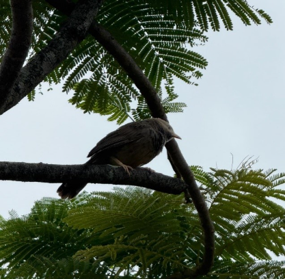

# Yellow-billed Babbler (Seven Sisters) (`Argya affinis (syn. Turdoides affinis)`)

| Taxonomic Field | Zoological & Ecological Specification |
| :--- | :--- |
| **Catalog ID** | `FA-08` |
| **Common Name** | Yellow-billed Babbler (Seven Sisters) |
| **Scientific Name** | *Argya affinis (syn. Turdoides affinis)* |
| **Family** | `Leiothrichidae` |
| **Order / Class** | `Passeriformes (Perching Birds)` |
| **Category** | Bird (Avifauna / Leiothrichidae) |
| **Taxonomic Guild** | **Birds (Avifauna)** |
| **Location of Observation** | **Pathway behind Dhanyas** |
| **Microhabitat** | Undergrowth, hedge perimeters, open ground |
| **Trophic Guild** | Secondary Consumer / Insectivore-Omnivore (Trophic Level 3) |
| **Survey Source** | Survey Specimen 20 |

---

## Field Observation Photograph

  

---

## Zoological Description & Natural History

Endemic southern Indian songbird renowned for foraging in tight communal flocks of 6 to 10 individuals ('Seven Sisters'). Energetically flips leaf litter to uncover hidden insects and larvae.

---

## Ecological Significance & Trophic Connections

- **Trophic Role**: Secondary Consumer / Insectivore-Omnivore (Trophic Level 3)
- **Ecosystem Service / Ecological Function**: Highly gregarious endemic passerine with a pale grey-white cap and yellowish bill. Forages in noisy groups on the ground and trees, consuming insects, berries, and nectar.
- **Position in Food Web**:
  - Serves as an active biological component in regulating campus species populations, nutrient recycling, and cross-trophic energy flow.

---

[⬅ Back to Fauna Index](../README.md) | [🏠 Back to Campus Inventory Root](../../README.md)
