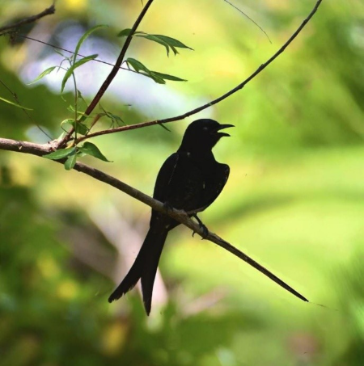

# Black Drongo (King Crow) (`Dicrurus macrocercus`)

| Taxonomic Field | Zoological & Ecological Specification |
| :--- | :--- |
| **Catalog ID** | `FA-09` |
| **Common Name** | Black Drongo (King Crow) |
| **Scientific Name** | *Dicrurus macrocercus* |
| **Family** | `Dicruridae` |
| **Order / Class** | `Passeriformes (Perching Birds)` |
| **Category** | Bird (Avifauna / Passerine) |
| **Taxonomic Guild** | **Birds (Avifauna)** |
| **Location of Observation** | **Metro Cafe** |
| **Microhabitat** | High electrical lines, open canopy perches |
| **Trophic Guild** | Secondary Consumer / Aerial Insectivore (Trophic Level 3) |
| **Survey Source** | Survey Specimen 21 |

---

## Field Observation Photograph

  

---

## Zoological Description & Natural History

All-black passerine with an unmistakable deeply forked tail. Renowned for its aerial acrobatic hunting displays catching dragonflies, cicadas, and moths mid-air.

---

## Ecological Significance & Trophic Connections

- **Trophic Role**: Secondary Consumer / Aerial Insectivore (Trophic Level 3)
- **Ecosystem Service / Ecological Function**: Agile insectivore with glossy black plumage and a distinct deeply forked tail. Perches high to hunt flying insects (hawking) and fearlessly mob raptors.
- **Position in Food Web**:
  - Serves as an active biological component in regulating campus species populations, nutrient recycling, and cross-trophic energy flow.

---

[⬅ Back to Fauna Index](../README.md) | [🏠 Back to Campus Inventory Root](../../README.md)
