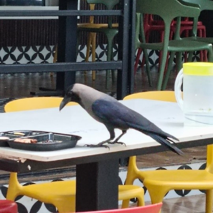

# House Crow (`Corvus splendens`)

| Taxonomic Field | Zoological & Ecological Specification |
| :--- | :--- |
| **Catalog ID** | `FA-10` |
| **Common Name** | House Crow |
| **Scientific Name** | *Corvus splendens* |
| **Family** | `Corvidae` |
| **Order / Class** | `Passeriformes (Perching Birds)` |
| **Category** | Bird (Avifauna / Corvidae) |
| **Taxonomic Guild** | **Birds (Avifauna)** |
| **Location of Observation** | **Campus-wide / Academic & Dining vicinity** |
| **Microhabitat** | Urban / Terrestrial (Anthropogenic environments) |
| **Trophic Guild** | Tertiary Consumer / Omnivorous Scavenger (Trophic Level 4) |
| **Survey Source** | Survey Specimen 22 |

---

## Field Observation Photograph

  

---

## Zoological Description & Natural History

Slender crow recognized by its pale grey nape, neck, and breast contrasted with glossy black forehead and wings. Acts as a campus scavenger and opportunist predator.

---

## Ecological Significance & Trophic Connections

- **Trophic Role**: Tertiary Consumer / Omnivorous Scavenger (Trophic Level 4)
- **Ecosystem Service / Ecological Function**: Omnivorous, highly intelligent urban bird characterized by a grey neck collar. Functions as a scavenger cleaning food scraps and biological waste across campus.
- **Position in Food Web**:
  - Serves as an active biological component in regulating campus species populations, nutrient recycling, and cross-trophic energy flow.

---

[⬅ Back to Fauna Index](../README.md) | [🏠 Back to Campus Inventory Root](../../README.md)
