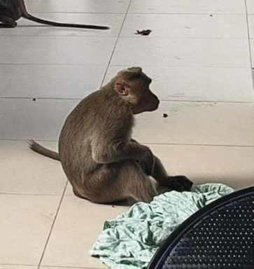

# Bonnet Macaque (`Macaca radiata`)

| Taxonomic Field | Zoological & Ecological Specification |
| :--- | :--- |
| **Catalog ID** | `FA-11` |
| **Common Name** | Bonnet Macaque |
| **Scientific Name** | *Macaca radiata* |
| **Family** | `Cercopithecidae` |
| **Order / Class** | `Primates (Monkeys & Apes)` |
| **Category** | Mammal (Primate / Simian) |
| **Taxonomic Guild** | **Mammals** |
| **Location of Observation** | **Gents Hostel** |
| **Microhabitat** | Tree canopies, building roofs, hostel terraces |
| **Trophic Guild** | Primary/Secondary Consumer & Frugivore (Trophic Level 2-3) |
| **Survey Source** | Survey Specimen 23 |

---

## Field Observation Photograph

  

---

## Zoological Description & Natural History

Arboreal cercopithecine monkey endemic to peninsular India, noted for its radiating cap of dark hair. Troops travel across campus trees feeding on date palm drupes, peppervine berries, and tree shoots.

---

## Ecological Significance & Trophic Connections

- **Trophic Role**: Primary/Secondary Consumer & Frugivore (Trophic Level 2-3)
- **Ecosystem Service / Ecological Function**: Endemic South Indian macaque recognized by the bonnet-like whorl of hair on its head. Plays a role in seed dispersal while foraging across fruits, leaves, and trees.
- **Position in Food Web**:
  - Serves as an active biological component in regulating campus species populations, nutrient recycling, and cross-trophic energy flow.

---

[⬅ Back to Fauna Index](../README.md) | [🏠 Back to Campus Inventory Root](../../README.md)
