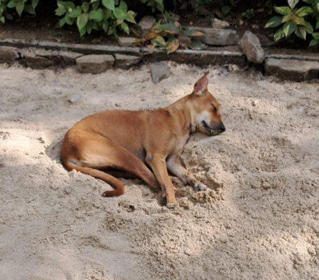

# Indian Pariah Dog (Desi Dog / INDog) (`Canis lupus familiaris`)

| Taxonomic Field | Zoological & Ecological Specification |
| :--- | :--- |
| **Catalog ID** | `FA-12` |
| **Common Name** | Indian Pariah Dog (Desi Dog / INDog) |
| **Scientific Name** | *Canis lupus familiaris* |
| **Family** | `Canidae` |
| **Order / Class** | `Carnivora (Carnivores)` |
| **Category** | Mammal (Carnivora / Canidae) |
| **Taxonomic Guild** | **Mammals** |
| **Location of Observation** | **Backside of AB3** |
| **Microhabitat** | Campus open grounds, shaded sandpits, shaded walkways |
| **Trophic Guild** | Tertiary Consumer / Apex Predator & Scavenger (Trophic Level 4) |
| **Survey Source** | Survey Specimen 24 |

---

## Field Observation Photograph

  

---

## Zoological Description & Natural History

Indigenous primitive landrace dog characterized by erect ears, wedge-shaped head, and curved tail. Functions as a territorial apex mammalian scavenger across the campus boundary.

---

## Ecological Significance & Trophic Connections

- **Trophic Role**: Tertiary Consumer / Apex Predator & Scavenger (Trophic Level 4)
- **Ecosystem Service / Ecological Function**: Ancient landrace indigenous dog breed adapted to tropical climate. Highly territorial and plays a scavenger role, co-existing peacefully within the campus ecosystem.
- **Position in Food Web**:
  - Serves as an active biological component in regulating campus species populations, nutrient recycling, and cross-trophic energy flow.

---

[⬅ Back to Fauna Index](../README.md) | [🏠 Back to Campus Inventory Root](../../README.md)
