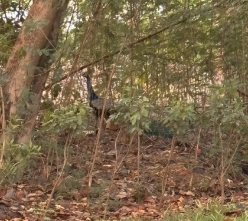

# Indian Peafowl (Peacock - National Bird of India) (`Pavo cristatus`)

| Taxonomic Field | Zoological & Ecological Specification |
| :--- | :--- |
| **Catalog ID** | `FA-13` |
| **Common Name** | Indian Peafowl (Peacock - National Bird of India) |
| **Scientific Name** | *Pavo cristatus* |
| **Family** | `Phasianidae` |
| **Order / Class** | `Galliformes (Gamebirds)` |
| **Category** | Bird (Avifauna / Galliformes) |
| **Taxonomic Guild** | **Birds (Avifauna)** |
| **Location of Observation** | **Pathway behind Dhanyas** |
| **Microhabitat** | Open scrub, grassy meadows, forest edges |
| **Trophic Guild** | Secondary / Tertiary Consumer & Predator (Trophic Level 3-4) |
| **Survey Source** | Survey Specimen 25 |

---

## Field Observation Photograph

  

---

## Zoological Description & Natural History

The National Bird of India, possessing iridescent cobalt blue neck plumage, fan-shaped crest, and magnificent elongated upper tail coverts with vibrant ocelli. Preys upon ground insects, snails, and lizards.

---

## Ecological Significance & Trophic Connections

- **Trophic Role**: Secondary / Tertiary Consumer & Predator (Trophic Level 3-4)
- **Ecosystem Service / Ecological Function**: Large ground bird with striking iridescent blue neck and fan crest. Omnivorous diet includes seeds, insects, and small reptiles (snakes), controlling garden pests.
- **Position in Food Web**:
  - Serves as an active biological component in regulating campus species populations, nutrient recycling, and cross-trophic energy flow.

---

[⬅ Back to Fauna Index](../README.md) | [🏠 Back to Campus Inventory Root](../../README.md)
