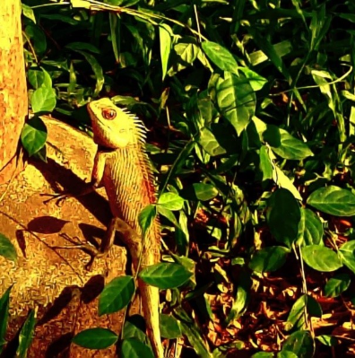

# Oriental Garden Lizard (Changeable Lizard) (`Calotes versicolor`)

| Taxonomic Field | Zoological & Ecological Specification |
| :--- | :--- |
| **Catalog ID** | `FA-14` |
| **Common Name** | Oriental Garden Lizard (Changeable Lizard) |
| **Scientific Name** | *Calotes versicolor* |
| **Family** | `Agamidae` |
| **Order / Class** | `Squamata (Lizards & Snakes)` |
| **Category** | Reptile (Squamata / Agamidae) |
| **Taxonomic Guild** | **Reptiles** |
| **Location of Observation** | **Pathway behind Dhanyas** |
| **Microhabitat** | Garden shrubs, low branches, sunny fence posts |
| **Trophic Guild** | Secondary Consumer / Insectivore (Trophic Level 3) |
| **Survey Source** | Survey Specimen 26 |

---

## Field Observation Photograph

  

---

## Zoological Description & Natural History

Diurnal arboreal agamid lizard capable of physiological color shifts. Males develop crimson throat patches during courtship. An efficient ambush predator regulating insect pest numbers.

---

## Ecological Significance & Trophic Connections

- **Trophic Role**: Secondary Consumer / Insectivore (Trophic Level 3)
- **Ecosystem Service / Ecological Function**: Diurnal agamid lizard capable of color change during breeding/thermoregulation. Feeds extensively on insect pests like crickets, moths, and caterpillars.
- **Position in Food Web**:
  - Serves as an active biological component in regulating campus species populations, nutrient recycling, and cross-trophic energy flow.

---

[⬅ Back to Fauna Index](../README.md) | [🏠 Back to Campus Inventory Root](../../README.md)
