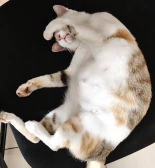

# Domestic Cat (Campus Tabby / Feral Cat) (`Felis catus`)

| Taxonomic Field | Zoological & Ecological Specification |
| :--- | :--- |
| **Catalog ID** | `FA-15` |
| **Common Name** | Domestic Cat (Campus Tabby / Feral Cat) |
| **Scientific Name** | *Felis catus* |
| **Family** | `Felidae` |
| **Order / Class** | `Carnivora (Carnivores)` |
| **Category** | Mammal (Carnivora / Felidae) |
| **Taxonomic Guild** | **Mammals** |
| **Location of Observation** | **Gents Hostel** |
| **Microhabitat** | Human-inhabited areas, dining halls, building perimeters |
| **Trophic Guild** | Tertiary Consumer / Small Carnivore & Apex Predator (Trophic Level 4) |
| **Survey Source** | Survey Specimen 27 |

---

## Field Observation Photograph

  

---

## Zoological Description & Natural History

Agile carnivorous feline adapted to semi-feral campus life. Serves as a vital biological regulator of commensal rodents and small invasive pests around student residences.

---

## Ecological Significance & Trophic Connections

- **Trophic Role**: Tertiary Consumer / Small Carnivore & Apex Predator (Trophic Level 4)
- **Ecosystem Service / Ecological Function**: Small carnivorous feline that controls campus rodent populations (mice, rats) around human-inhabited areas.
- **Position in Food Web**:
  - Serves as an active biological component in regulating campus species populations, nutrient recycling, and cross-trophic energy flow.

---

[⬅ Back to Fauna Index](../README.md) | [🏠 Back to Campus Inventory Root](../../README.md)
