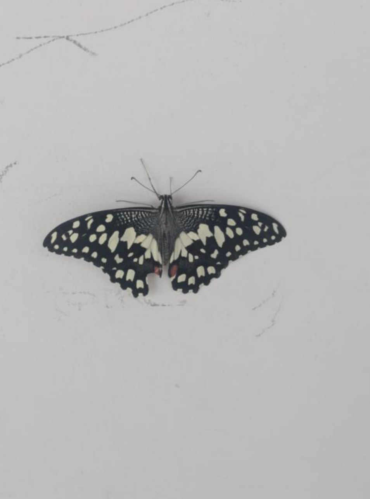

# Common Lime Butterfly / Lemon Swallowtail (`Papilio demoleus`)

| Field Attribute | Taxonomic / Ecological Specification |
| :--- | :--- |
| **Catalog ID** | `FA-16` |
| **Common Name** | Common Lime Butterfly / Lemon Swallowtail |
| **Scientific Name** | *Papilio demoleus* |
| **Family** | `Papilionidae` |
| **Order** | `Lepidoptera (Butterflies & Moths)` |
| **Taxonomic Guild** | Insects / Arthropods |
| **Location of Observation** | **AB1 & Campus Gardens** |
| **Microhabitat** | Gardens, flowering vegetation, open areas |
| **Trophic Level** | Primary Consumer / Herbivore (Trophic Level 2) |
| **Contributing Survey Team** | **Team Katyayani** |
| **Survey Source** | Assignment 2 Survey (Team Katyayani) |

---

## Field Observation Photograph

---

## Zoological & Morphological Description

Prominent swallowtail butterfly displaying black wings densely patterned with sulfur-yellow markings and a blue-and-red eyespot on the inner margin of hindwings. Larvae feed on Rutaceae.

---

## Ecological Role & Campus Interactions

- **Trophic Level**: Primary Consumer / Herbivore (Trophic Level 2)
- **Ecosystem Service**: Fast-flying tailless swallowtail with intricate yellowish-white chevron patterns on black wings and distinct tornal red eye-spots. Key pollinator of flowering campus shrubs.
- **Campus Food Web Dynamics**:
  - Participates actively in predator-prey or plant-pollinator networks across campus zones.
  - Contributes to population regulation, seed dispersal, or detrital soil nutrient cycling.

---

[⬅ Back to Fauna Index](../README.md) | [🏠 Back to Campus Inventory Root](../../README.md)
