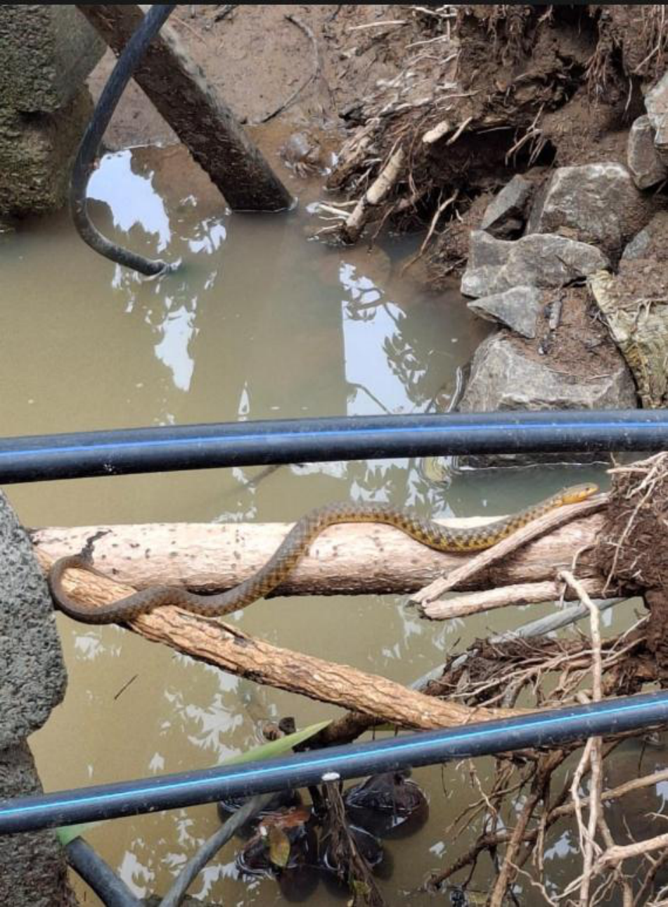

# Checkered Keelback (Asiatic Water Snake) (`Fowlea piscator`)

| Field Attribute | Taxonomic / Ecological Specification |
| :--- | :--- |
| **Catalog ID** | `FA-17` |
| **Common Name** | Checkered Keelback (Asiatic Water Snake) |
| **Scientific Name** | *Fowlea piscator* |
| **Family** | `Colubridae` |
| **Order** | `Squamata (Lizards & Snakes)` |
| **Taxonomic Guild** | Reptiles |
| **Location of Observation** | **Bio Block & Storm-water drain off Hostel Link Road** |
| **Microhabitat** | Wetlands, drains, standing water and freshwater margins |
| **Trophic Level** | Tertiary Consumer / Carnivore (Trophic Level 3-4) |
| **Contributing Survey Team** | **Team Katyayani** |
| **Survey Source** | Assignment 2 Survey (Team Katyayani & Team Prathin & Team Rehan) |

---

## Field Observation Photograph

---

## Zoological & Morphological Description

Robust medium-sized freshwater snake with keeled dorsal scales and characteristic checkered black-and-olive dorsal pattern. Demonstrates exceptional diving and swimming agility.

---

## Ecological Role & Campus Interactions

- **Trophic Level**: Tertiary Consumer / Carnivore (Trophic Level 3-4)
- **Ecosystem Service**: Semi-aquatic non-venomous colubrid snake that feeds primarily on fish, frogs, and small amphibians in campus stormwater drains, serving as a biological regulator of drain wetland fauna.
- **Campus Food Web Dynamics**:
  - Participates actively in predator-prey or plant-pollinator networks across campus zones.
  - Contributes to population regulation, seed dispersal, or detrital soil nutrient cycling.

---

[⬅ Back to Fauna Index](../README.md) | [🏠 Back to Campus Inventory Root](../../README.md)
