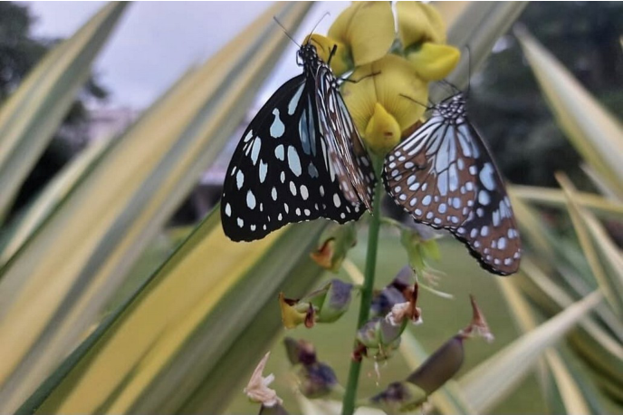

# Blue Tiger Butterfly (`Tirumala limniace`)

| Field Attribute | Taxonomic / Ecological Specification |
| :--- | :--- |
| **Catalog ID** | `FA-18` |
| **Common Name** | Blue Tiger Butterfly |
| **Scientific Name** | *Tirumala limniace* |
| **Family** | `Nymphalidae` |
| **Order** | `Lepidoptera (Butterflies & Moths)` |
| **Taxonomic Guild** | Insects / Arthropods |
| **Location of Observation** | **Perimeter green belt shrubbery** |
| **Microhabitat** | Semi-shaded green belt and nectar shrubbery |
| **Trophic Level** | Primary Consumer / Herbivore (Trophic Level 2) |
| **Contributing Survey Team** | **Team Prathin** |
| **Survey Source** | Assignment 2 Survey (Team Prathin) |

---

## Field Observation Photograph

---

## Zoological & Morphological Description

Large, elegant danaid butterfly featuring blackish-brown wings with distinct bluish-white semi-transparent streaks and submarginal spots.

---

## Ecological Role & Campus Interactions

- **Trophic Level**: Primary Consumer / Herbivore (Trophic Level 2)
- **Ecosystem Service**: Aposematically colored butterfly sequestering toxic cardenolides from host plants, rendering it unpalatable to predatory birds. Efficient pollinator with slow, cruising flight.
- **Campus Food Web Dynamics**:
  - Participates actively in predator-prey or plant-pollinator networks across campus zones.
  - Contributes to population regulation, seed dispersal, or detrital soil nutrient cycling.

---

[Back to Fauna Index](../README.md) | [Back to Campus Inventory Root](../../README.md)
