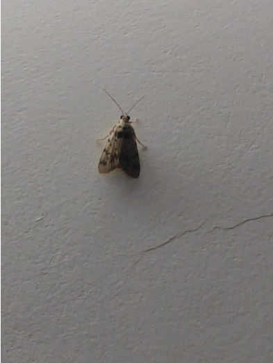

# Noctuid Owlet Moth (`Noctuidae sp.`)

| Field Attribute | Taxonomic / Ecological Specification |
| :--- | :--- |
| **Catalog ID** | `FA-19` |
| **Common Name** | Noctuid Owlet Moth |
| **Scientific Name** | *Noctuidae sp.* |
| **Family** | `Noctuidae` |
| **Order** | `Lepidoptera (Butterflies & Moths)` |
| **Taxonomic Guild** | Insects / Arthropods |
| **Location of Observation** | **Service road south of Hostel Link Road** |
| **Microhabitat** | Corridor walls near outdoor nighttime illumination |
| **Trophic Level** | Primary Consumer / Herbivore (Trophic Level 2) |
| **Contributing Survey Team** | **Team Prathin** |
| **Survey Source** | Assignment 2 Survey (Team Prathin) |

---

## Field Observation Photograph

---

## Zoological & Morphological Description

Cryptically camouflaged stout-bodied moth with drab greyish-brown forewings held roof-like over the body at rest.

---

## Ecological Role & Campus Interactions

- **Trophic Level**: Primary Consumer / Herbivore (Trophic Level 2)
- **Ecosystem Service**: Nocturnally active moth attracted to exterior artificial lights, forming an essential nocturnal food base for hunting campus geckos and resting garden lizards.
- **Campus Food Web Dynamics**:
  - Participates actively in predator-prey or plant-pollinator networks across campus zones.
  - Contributes to population regulation, seed dispersal, or detrital soil nutrient cycling.

---

[⬅ Back to Fauna Index](../README.md) | [🏠 Back to Campus Inventory Root](../../README.md)
