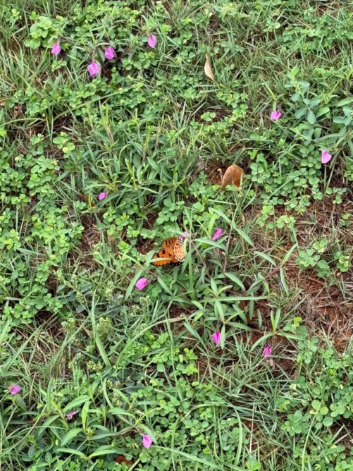

# Tawny Coster (`Acraea terpsicore`)

| Field Attribute | Taxonomic / Ecological Specification |
| :--- | :--- |
| **Catalog ID** | `FA-20` |
| **Common Name** | Tawny Coster |
| **Scientific Name** | *Acraea terpsicore* |
| **Family** | `Nymphalidae` |
| **Order** | `Lepidoptera (Butterflies & Moths)` |
| **Taxonomic Guild** | Insects / Arthropods |
| **Location of Observation** | **Near Cricket Ground & Main Canteen lawns** |
| **Microhabitat** | Open grassy patches with low flowering herbs |
| **Trophic Level** | Primary Consumer / Herbivore (Trophic Level 2) |
| **Contributing Survey Team** | **Team Rehan** |
| **Survey Source** | Assignment 2 Survey (Team Rehan) |

---

## Field Observation Photograph

---

## Zoological & Morphological Description

Small-to-medium butterfly with translucent tawny-orange wings bordered by a black margin embedded with white spots and black transverse spots on forewings.

---

## Ecological Role & Campus Interactions

- **Trophic Level**: Primary Consumer / Herbivore (Trophic Level 2)
- **Ecosystem Service**: Hardy aposematic butterfly that exhibits unpalatability to predators by secreting foul fluids from legs. Pollinates ground composites (Tridax, Persicaria).
- **Campus Food Web Dynamics**:
  - Participates actively in predator-prey or plant-pollinator networks across campus zones.
  - Contributes to population regulation, seed dispersal, or detrital soil nutrient cycling.

---

[⬅ Back to Fauna Index](../README.md) | [🏠 Back to Campus Inventory Root](../../README.md)
