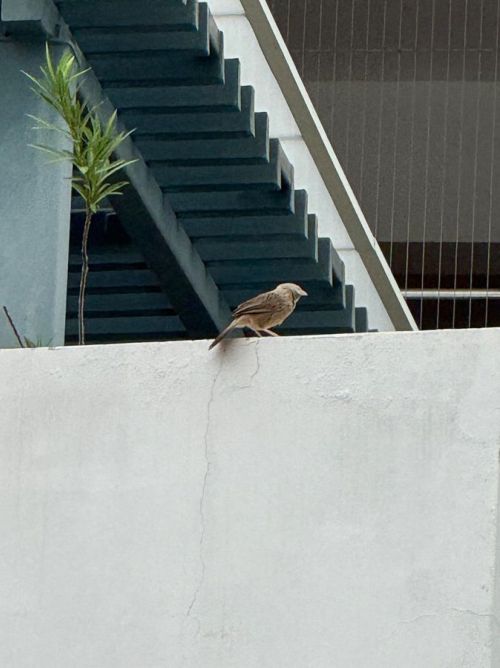

# Jungle Babbler (`Argya striata`)

| Field Attribute | Taxonomic / Ecological Specification |
| :--- | :--- |
| **Catalog ID** | `FA-21` |
| **Common Name** | Jungle Babbler |
| **Scientific Name** | *Argya striata* |
| **Family** | `Leiothrichidae` |
| **Order** | `Passeriformes (Perching Birds)` |
| **Taxonomic Guild** | Birds (Avifauna) |
| **Location of Observation** | **AB1 Cafeteria & Garden perimeters** |
| **Microhabitat** | Building ledges, low dense shrubbery, gregarious flocks |
| **Trophic Level** | Secondary Consumer / Insectivore-Omnivore (Trophic Level 3) |
| **Contributing Survey Team** | **Team Rehan** |
| **Survey Source** | Assignment 2 Survey (Team Rehan) |

---

## Field Observation Photograph

---

## Zoological & Morphological Description

Medium-sized brownish-grey songbird with pale creamy eyes, heavy yellow bill, and mottled upperparts. Travels in close-knit groups through lower vegetation.

---

## Ecological Role & Campus Interactions

- **Trophic Level**: Secondary Consumer / Insectivore-Omnivore (Trophic Level 3)
- **Ecosystem Service**: Congeneric cousin to the Yellow-billed Babbler, distinguished by its uniformly mottled earthy-grey plumage and faint streaking. Forages in noisy cooperative groups, aerating leaf litter and gleaning insect pests.
- **Campus Food Web Dynamics**:
  - Participates actively in predator-prey or plant-pollinator networks across campus zones.
  - Contributes to population regulation, seed dispersal, or detrital soil nutrient cycling.

---

[⬅ Back to Fauna Index](../README.md) | [🏠 Back to Campus Inventory Root](../../README.md)
