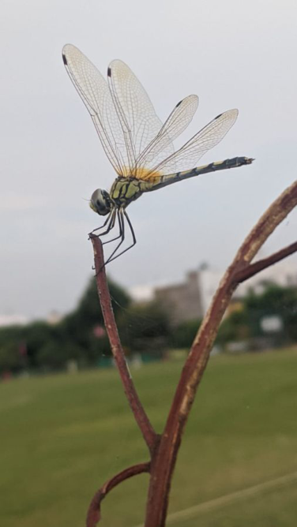

# Long-legged Marsh Glider (`Trithemis pallidinervis`)

| Field Attribute | Taxonomic / Ecological Specification |
| :--- | :--- |
| **Catalog ID** | `FA-22` |
| **Common Name** | Long-legged Marsh Glider |
| **Scientific Name** | *Trithemis pallidinervis* |
| **Family** | `Libellulidae` |
| **Order** | `Odonata (Dragonflies & Damselflies)` |
| **Taxonomic Guild** | Insects / Arthropods |
| **Location of Observation** | **Near Cricket Ground & Wetland margins** |
| **Microhabitat** | Open grassland, dry twigs near marshy terrain |
| **Trophic Level** | Secondary Consumer / Aerial Predator (Trophic Level 3) |
| **Contributing Survey Team** | **Team Viswa** |
| **Survey Source** | Assignment 2 Survey (Team Viswa) |

---

## Field Observation Photograph

---

## Zoological & Morphological Description

Medium dragonfly with yellowish-brown thorax, black-and-yellow patterned abdomen, red pterostigma, and noticeably elongated legs used to perch prominently on dry stalks.

---

## Ecological Role & Campus Interactions

- **Trophic Level**: Secondary Consumer / Aerial Predator (Trophic Level 3)
- **Ecosystem Service**: Distinctive slender dragonfly characterized by exceptionally long legs adapted to perch on bare emergent twigs facing windward. Voracious predator of mosquitoes, gnats, and flies.
- **Campus Food Web Dynamics**:
  - Participates actively in predator-prey or plant-pollinator networks across campus zones.
  - Contributes to population regulation, seed dispersal, or detrital soil nutrient cycling.

---

[Back to Fauna Index](../README.md) | [Back to Campus Inventory Root](../../README.md)
