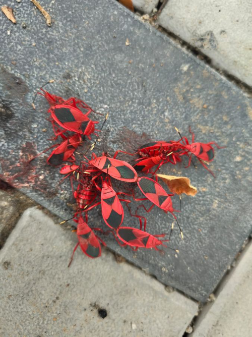

# Indian Red Bug (`Probergrothius sanguinolens`)

| Field Attribute | Taxonomic / Ecological Specification |
| :--- | :--- |
| **Catalog ID** | `FA-23` |
| **Common Name** | Indian Red Bug |
| **Scientific Name** | *Probergrothius sanguinolens* |
| **Family** | `Largidae` |
| **Order** | `Hemiptera (True Bugs)` |
| **Taxonomic Guild** | Insects / Arthropods |
| **Location of Observation** | **Pathway near main canteen** |
| **Microhabitat** | Sunny pavement, masonry bases, leaf litter near trees |
| **Trophic Level** | Primary Consumer / Seed Bug (Trophic Level 2) |
| **Contributing Survey Team** | **Team Viswa** |
| **Survey Source** | Assignment 2 Survey (Team Viswa) |

---

## Field Observation Photograph

---

## Zoological & Morphological Description

Stout shield-shaped bug with vivid orange-red thorax and hemelytra marked with distinct black central rhomboid patches. Distinct from Dysdercus cingulatus.

---

## Ecological Role & Campus Interactions

- **Trophic Level**: Primary Consumer / Seed Bug (Trophic Level 2)
- **Ecosystem Service**: Aposematic hemipteran that feeds on fallen tree seeds (especially Sterculiaceae & Malvaceae), aggregating in large gregarious clusters on sunlit pavements.
- **Campus Food Web Dynamics**:
  - Participates actively in predator-prey or plant-pollinator networks across campus zones.
  - Contributes to population regulation, seed dispersal, or detrital soil nutrient cycling.

---

[Back to Fauna Index](../README.md) | [Back to Campus Inventory Root](../../README.md)
