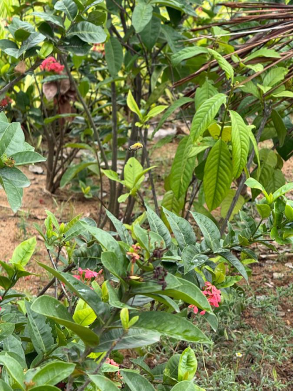

# Asian Honeybee / Indian Honeybee (`Apis cerana`)

| Field Attribute | Taxonomic / Ecological Specification |
| :--- | :--- |
| **Catalog ID** | `FA-24` |
| **Common Name** | Asian Honeybee / Indian Honeybee |
| **Scientific Name** | *Apis cerana* |
| **Family** | `Apidae` |
| **Order** | `Hymenoptera (Wasps, Bees, Ants)` |
| **Taxonomic Guild** | Insects / Arthropods |
| **Location of Observation** | **Near AB3** |
| **Microhabitat** | Foraging across Ixora and Hibiscus floral beds |
| **Trophic Level** | Primary Consumer / Kept & Wild Pollinator (Trophic Level 2) |
| **Contributing Survey Team** | **Team Rehan** |
| **Survey Source** | Assignment 2 Survey (Team Rehan) |

---

## Field Observation Photograph

---

## Zoological & Morphological Description

Medium-sized honeybee with golden-yellow and dark brown abdominal stripes, hairy thorax, and specialized pollen baskets (corbiculae) on hind legs.

---

## Ecological Role & Campus Interactions

- **Trophic Level**: Primary Consumer / Kept & Wild Pollinator (Trophic Level 2)
- **Ecosystem Service**: Indigenous wild social honeybee vital for campus cross-pollination. Forages extensively on tubular Ixora flowers, transferring pollen across flora.
- **Campus Food Web Dynamics**:
  - Participates actively in predator-prey or plant-pollinator networks across campus zones.
  - Contributes to population regulation, seed dispersal, or detrital soil nutrient cycling.

---

[⬅ Back to Fauna Index](../README.md) | [🏠 Back to Campus Inventory Root](../../README.md)
