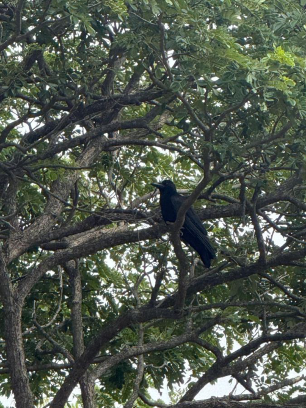

# Greater Coucal / Southern Crow Pheasant (`Centropus sinensis`)

| Field Attribute | Taxonomic / Ecological Specification |
| :--- | :--- |
| **Catalog ID** | `FA-25` |
| **Common Name** | Greater Coucal / Southern Crow Pheasant |
| **Scientific Name** | *Centropus sinensis* |
| **Family** | `Cuculidae` |
| **Order** | `Cuculiformes (Cuckoos)` |
| **Taxonomic Guild** | Birds (Avifauna) |
| **Location of Observation** | **Near Football ground** |
| **Microhabitat** | Dense tree canopy, campus grove, tangled thickets |
| **Trophic Level** | Tertiary / Apex Avian Predator (Trophic Level 4) |
| **Contributing Survey Team** | **Team Viswa** |
| **Survey Source** | Assignment 2 Survey (Team Viswa) |

---

## Field Observation Photograph

---

## Zoological & Morphological Description

Striking large glossy-black bird with contrasting deep chestnut-rufous wings and ruby-red eyes. Renowned for its deep resonant 'coop-coop-coop' territorial call.

---

## Ecological Role & Campus Interactions

- **Trophic Level**: Tertiary / Apex Avian Predator (Trophic Level 4)
- **Ecosystem Service**: Large non-parasitic cuckoo that stalks ground and lower branches hunting snakes (including keelbacks), lizards, large beetles, snails, and caterpillars. Acts as a top avian regulator.
- **Campus Food Web Dynamics**:
  - Participates actively in predator-prey or plant-pollinator networks across campus zones.
  - Contributes to population regulation, seed dispersal, or detrital soil nutrient cycling.

---

[Back to Fauna Index](../README.md) | [Back to Campus Inventory Root](../../README.md)
