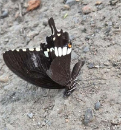

# Common Mormon Butterfly (`Papilio polytes`)

| Field Attribute | Taxonomic / Ecological Specification |
| :--- | :--- |
| **Catalog ID** | `FA-26` |
| **Common Name** | Common Mormon Butterfly |
| **Scientific Name** | *Papilio polytes* |
| **Family** | `Papilionidae` |
| **Order** | `Lepidoptera (Butterflies & Moths)` |
| **Taxonomic Guild** | Insects / Arthropods |
| **Location of Observation** | **Central Gardens & Citrus Shrub Borders** |
| **Microhabitat** | Flowering hedges, open sunny garden beds |
| **Trophic Level** | Primary Consumer / Pollinator (Trophic Level 2) |
| **Contributing Survey Team** | **Team Shatmika** |
| **Survey Source** | Assignment 2 Survey (Team Shatmika) |

---

## Field Observation Photograph

---

## Zoological & Morphological Description

Jet-black swallowtail butterfly; males display a distinct band of white discal spots across the hindwing, while females display polymorphic Batesian mimicry morphs.

---

## Ecological Role & Campus Interactions

- **Trophic Level**: Primary Consumer / Pollinator (Trophic Level 2)
- **Ecosystem Service**: Classic Batesian mimic butterfly whose females mimic unpalatable species like the Crimson Rose. Larvae graze on Rutaceae plants while adults are active pollinators.
- **Campus Food Web Dynamics**:
  - Participates actively in predator-prey or plant-pollinator networks across campus zones.
  - Contributes to population regulation, seed dispersal, or detrital soil nutrient cycling.

---

[⬅ Back to Fauna Index](../README.md) | [🏠 Back to Campus Inventory Root](../../README.md)
