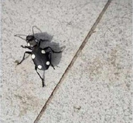

# Domino Beetle / Six-spotted Ground Beetle (`Anthia sexguttata`)

| Field Attribute | Taxonomic / Ecological Specification |
| :--- | :--- |
| **Catalog ID** | `FA-27` |
| **Common Name** | Domino Beetle / Six-spotted Ground Beetle |
| **Scientific Name** | *Anthia sexguttata* |
| **Family** | `Carabidae` |
| **Order** | `Coleoptera (Beetles)` |
| **Taxonomic Guild** | Insects / Arthropods |
| **Location of Observation** | **Vama Sundari Park & Dry Scrub Paths** |
| **Microhabitat** | Ground surface, sandy soil, and dry leaf litter |
| **Trophic Level** | Secondary Consumer / Predator (Trophic Level 3) |
| **Contributing Survey Team** | **Team Lokranjan** |
| **Survey Source** | Assignment 2 Survey (Team Lokranjan) |

---

## Field Observation Photograph

---

## Zoological & Morphological Description

Large, flightless ground beetle with a velvety black body ornamented with six conspicuous creamy-white dorsal spots (four on elytra, two on thorax).

---

## Ecological Role & Campus Interactions

- **Trophic Level**: Secondary Consumer / Predator (Trophic Level 3)
- **Ecosystem Service**: Fierce cursorial ground predator hunting ants, caterpillars, and soft-bodied insects. Defends itself by spraying irritating formic acid when threatened.
- **Campus Food Web Dynamics**:
  - Participates actively in predator-prey or plant-pollinator networks across campus zones.
  - Contributes to population regulation, seed dispersal, or detrital soil nutrient cycling.

---

[⬅ Back to Fauna Index](../README.md) | [🏠 Back to Campus Inventory Root](../../README.md)
