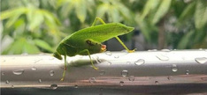

# Bush Cricket / Katydid (`Tettigoniidae sp.`)

| Field Attribute | Taxonomic / Ecological Specification |
| :--- | :--- |
| **Catalog ID** | `FA-28` |
| **Common Name** | Bush Cricket / Katydid |
| **Scientific Name** | *Tettigoniidae sp.* |
| **Family** | `Tettigoniidae` |
| **Order** | `Orthoptera (Grasshoppers & Crickets)` |
| **Taxonomic Guild** | Insects / Arthropods |
| **Location of Observation** | **Hostel Greenery & Low Shrub Foliage** |
| **Microhabitat** | Dense foliage, tall grasses, and shrub crowns |
| **Trophic Level** | Primary Consumer / Herbivore (Trophic Level 2) |
| **Contributing Survey Team** | **Team Shatmika** |
| **Survey Source** | Assignment 2 Survey (Team Shatmika) |

---

## Field Observation Photograph

---

## Zoological & Morphological Description

Bright green cricket with exceptionally long, hair-like antennae exceeding body length and leaf-shaped wings that provide camouflage among foliage.

---

## Ecological Role & Campus Interactions

- **Trophic Level**: Primary Consumer / Herbivore (Trophic Level 2)
- **Ecosystem Service**: Leaf-mimicking nocturnal herbivore that feeds on foliage, flowers, and buds. Serves as key prey for lizards, praying mantises, and birds.
- **Campus Food Web Dynamics**:
  - Participates actively in predator-prey or plant-pollinator networks across campus zones.
  - Contributes to population regulation, seed dispersal, or detrital soil nutrient cycling.

---

[⬅ Back to Fauna Index](../README.md) | [🏠 Back to Campus Inventory Root](../../README.md)
