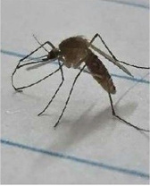

# House Mosquito / True Mosquito (`Culex sp.`)

| Field Attribute | Taxonomic / Ecological Specification |
| :--- | :--- |
| **Catalog ID** | `FA-29` |
| **Common Name** | House Mosquito / True Mosquito |
| **Scientific Name** | *Culex sp.* |
| **Family** | `Culicidae` |
| **Order** | `Diptera (True Flies)` |
| **Taxonomic Guild** | Insects / Arthropods |
| **Location of Observation** | **Drainage Channels & Shaded Corridors** |
| **Microhabitat** | Stagnant water pools, drainage channels, shaded corridors |
| **Trophic Level** | Primary / Parasitic Consumer (Trophic Level 2-3) |
| **Contributing Survey Team** | **Team Shatmika** |
| **Survey Source** | Assignment 2 Survey (Team Shatmika) |

---

## Field Observation Photograph

---

## Zoological & Morphological Description

Slender, long-legged insect with piercing-sucking proboscis and scaled wing veins. Rests with thorax and abdomen held parallel to the resting surface.

---

## Ecological Role & Campus Interactions

- **Trophic Level**: Primary / Parasitic Consumer (Trophic Level 2-3)
- **Ecosystem Service**: Aquatic larvae filter organic particulate matter in standing pools; adults feed on plant nectar (males) or vertebrate blood (females), serving as critical prey for dragonflies and bats.
- **Campus Food Web Dynamics**:
  - Participates actively in predator-prey or plant-pollinator networks across campus zones.
  - Contributes to population regulation, seed dispersal, or detrital soil nutrient cycling.

---

[Back to Fauna Index](../README.md) | [Back to Campus Inventory Root](../../README.md)
