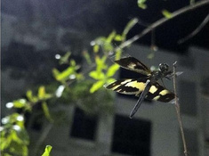

# Common Picture Wing Dragonfly / Variegated Flutterer (`Rhyothemis variegata`)

| Field Attribute | Taxonomic / Ecological Specification |
| :--- | :--- |
| **Catalog ID** | `FA-30` |
| **Common Name** | Common Picture Wing Dragonfly / Variegated Flutterer |
| **Scientific Name** | *Rhyothemis variegata* |
| **Family** | `Libellulidae` |
| **Order** | `Odonata (Dragonflies & Damselflies)` |
| **Taxonomic Guild** | Insects / Arthropods |
| **Location of Observation** | **Campus Wetland Basin & Open Lawns** |
| **Microhabitat** | Open airspace near ponds, drainage basins, and marshy lawns |
| **Trophic Level** | Secondary Consumer / Aerial Predator (Trophic Level 3) |
| **Contributing Survey Team** | **Team Shatmika** |
| **Survey Source** | Assignment 2 Survey (Team Shatmika) |

---

## Field Observation Photograph

---

## Zoological & Morphological Description

Striking dragonfly with golden-amber and iridescent dark purplish-brown mottled wings resembling butterfly wings. Flutters gently above water margins.

---

## Ecological Role & Campus Interactions

- **Trophic Level**: Secondary Consumer / Aerial Predator (Trophic Level 3)
- **Ecosystem Service**: Distinctive fluttering dragonfly with butterfly-like flapping flight. An agile aerial insectivore preying on gnats, midges, and mosquitoes over campus water bodies.
- **Campus Food Web Dynamics**:
  - Participates actively in predator-prey or plant-pollinator networks across campus zones.
  - Contributes to population regulation, seed dispersal, or detrital soil nutrient cycling.

---

[⬅ Back to Fauna Index](../README.md) | [🏠 Back to Campus Inventory Root](../../README.md)
