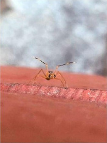

# Asian Weaver Ant-mimicking Jumping Spider (`Myrmaplata plataleoides`)

| Field Attribute | Taxonomic / Ecological Specification |
| :--- | :--- |
| **Catalog ID** | `FA-31` |
| **Common Name** | Asian Weaver Ant-mimicking Jumping Spider |
| **Scientific Name** | *Myrmaplata plataleoides* |
| **Family** | `Salticidae` |
| **Order** | `Araneae (Spiders)` |
| **Taxonomic Guild** | Arachnids / Arthropods |
| **Location of Observation** | **Foliage of Mango and Guava Trees** |
| **Microhabitat** | Leaves and twigs of bushes inhabited by Asian weaver ants |
| **Trophic Level** | Secondary Consumer / Ambush Predator (Trophic Level 3) |
| **Contributing Survey Team** | **Team Shatmika** |
| **Survey Source** | Assignment 2 Survey (Team Shatmika) |

---

## Field Observation Photograph

---

## Zoological & Morphological Description

Slender jumping spider with an elongated abdomen and waist-like cephalic constrictions mimicking an ant body. Males possess elongated forward-pointing chelicerae.

---

## Ecological Role & Campus Interactions

- **Trophic Level**: Secondary Consumer / Ambush Predator (Trophic Level 3)
- **Ecosystem Service**: Extraordinary Batesian and aggressive mimic that perfectly resembles aggressive weaver ants (*Oecophylla smaragdina*) to deter predators while hunting small insects.
- **Campus Food Web Dynamics**:
  - Participates actively in predator-prey or plant-pollinator networks across campus zones.
  - Contributes to population regulation, seed dispersal, or detrital soil nutrient cycling.

---

[Back to Fauna Index](../README.md) | [Back to Campus Inventory Root](../../README.md)
