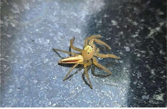

# Two-striped Jumper Spider (`Telamonia dimidiata`)

| Field Attribute | Taxonomic / Ecological Specification |
| :--- | :--- |
| **Catalog ID** | `FA-32` |
| **Common Name** | Two-striped Jumper Spider |
| **Scientific Name** | *Telamonia dimidiata* |
| **Family** | `Salticidae` |
| **Order** | `Araneae (Spiders)` |
| **Taxonomic Guild** | Arachnids / Arthropods |
| **Location of Observation** | **Campus Hedges & Garden Leaves** |
| **Microhabitat** | Shrub leaves, tree bark, sunny foliage |
| **Trophic Level** | Secondary Consumer / Visual Predator (Trophic Level 3) |
| **Contributing Survey Team** | **Team Lokranjan** |
| **Survey Source** | Assignment 2 Survey (Team Lokranjan) |

---

## Field Observation Photograph

---

## Zoological & Morphological Description

Slender, colorful salticid spider; females exhibit a yellowish-green body with two prominent longitudinal reddish-brown stripes along the opisthosoma.

---

## Ecological Role & Campus Interactions

- **Trophic Level**: Secondary Consumer / Visual Predator (Trophic Level 3)
- **Ecosystem Service**: Diurnal visual hunter with acute stereoscopic vision that stalks and pounces on flies, leafhoppers, and small garden insects without building silk webs.
- **Campus Food Web Dynamics**:
  - Participates actively in predator-prey or plant-pollinator networks across campus zones.
  - Contributes to population regulation, seed dispersal, or detrital soil nutrient cycling.

---

[⬅ Back to Fauna Index](../README.md) | [🏠 Back to Campus Inventory Root](../../README.md)
