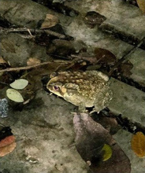

# Asian Common Toad / Black-spined Toad (`Duttaphrynus melanostictus`)

| Field Attribute | Taxonomic / Ecological Specification |
| :--- | :--- |
| **Catalog ID** | `FA-33` |
| **Common Name** | Asian Common Toad / Black-spined Toad |
| **Scientific Name** | *Duttaphrynus melanostictus* |
| **Family** | `Bufonidae` |
| **Order** | `Anura (Frogs & Toads)` |
| **Taxonomic Guild** | Amphibians / Vertebrates |
| **Location of Observation** | **Damp Garden Soil & Building Foundations** |
| **Microhabitat** | Damp leaf litter, garden soil, drain margins, nocturnal walkways |
| **Trophic Level** | Secondary Consumer / Insectivore (Trophic Level 3) |
| **Contributing Survey Team** | **Team Shatmika** |
| **Survey Source** | Assignment 2 Survey (Team Shatmika) |

---

## Field Observation Photograph

---

## Zoological & Morphological Description

Medium to large stout-bodied toad with rough, warty skin accented by black-tipped spines and elevated cranial ridges. Active primarily at dusk and during humid weather.

---

## Ecological Role & Campus Interactions

- **Trophic Level**: Secondary Consumer / Insectivore (Trophic Level 3)
- **Ecosystem Service**: Nocturnal terrestrial amphibian consuming large numbers of insects, termites, and snails. Features prominent parotoid glands secreting protective bufotoxins.
- **Campus Food Web Dynamics**:
  - Participates actively in predator-prey or plant-pollinator networks across campus zones.
  - Contributes to population regulation, seed dispersal, or detrital soil nutrient cycling.

---

[⬅ Back to Fauna Index](../README.md) | [🏠 Back to Campus Inventory Root](../../README.md)
