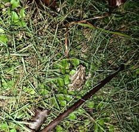

# Indian Cricket Frog / Wetland Paddy Frog (`Fejervarya sp. (syn. Minervarya sp.)`)

| Field Attribute | Taxonomic / Ecological Specification |
| :--- | :--- |
| **Catalog ID** | `FA-34` |
| **Common Name** | Indian Cricket Frog / Wetland Paddy Frog |
| **Scientific Name** | *Fejervarya sp. (syn. Minervarya sp.)* |
| **Family** | `Dicroglossidae` |
| **Order** | `Anura (Frogs & Toads)` |
| **Taxonomic Guild** | Amphibians / Vertebrates |
| **Location of Observation** | **Campus Stormwater Channel & Wet Grass** |
| **Microhabitat** | Moist grass, seasonal puddles, edges of drainage ditches |
| **Trophic Level** | Secondary Consumer / Insectivore (Trophic Level 3) |
| **Contributing Survey Team** | **Team Shatmika** |
| **Survey Source** | Assignment 2 Survey (Team Shatmika) |

---

## Field Observation Photograph

---

## Zoological & Morphological Description

Small cryptic frog with longitudinal glandular ridges along its greyish-brown dorsum and pointed snout. Renowned for its rapid, repeating cricket-like advertisement calls.

---

## Ecological Role & Campus Interactions

- **Trophic Level**: Secondary Consumer / Insectivore (Trophic Level 3)
- **Ecosystem Service**: Small, moisture-dependent frog that feeds voraciously on aquatic and semi-terrestrial insect larvae. Serves as primary prey for water snakes and egrets.
- **Campus Food Web Dynamics**:
  - Participates actively in predator-prey or plant-pollinator networks across campus zones.
  - Contributes to population regulation, seed dispersal, or detrital soil nutrient cycling.

---

[⬅ Back to Fauna Index](../README.md) | [🏠 Back to Campus Inventory Root](../../README.md)
