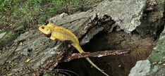

# Peninsular Rock Agama / South Indian Rock Agama (`Psammophilus dorsalis`)

| Field Attribute | Taxonomic / Ecological Specification |
| :--- | :--- |
| **Catalog ID** | `FA-35` |
| **Common Name** | Peninsular Rock Agama / South Indian Rock Agama |
| **Scientific Name** | *Psammophilus dorsalis* |
| **Family** | `Agamidae` |
| **Order** | `Squamata (Lizards & Snakes)` |
| **Taxonomic Guild** | Reptiles |
| **Location of Observation** | **Stone Kerbs & Sunlit Boulder Formations** |
| **Microhabitat** | Rocky outcrops, granite landscaping blocks, brick walls |
| **Trophic Level** | Secondary Consumer / Insectivore (Trophic Level 3) |
| **Contributing Survey Team** | **Team Shatmika** |
| **Survey Source** | Assignment 2 Survey (Team Shatmika) |

---

## Field Observation Photograph

---

## Zoological & Morphological Description

Flattened rock-dwelling agamid with a triangular head and keeled scales. Breeding males exhibit brilliant orange or crimson head and back contrasted with jet-black sides.

---

## Ecological Role & Campus Interactions

- **Trophic Level**: Secondary Consumer / Insectivore (Trophic Level 3)
- **Ecosystem Service**: Heliothermic saxicolous lizard that basks on rocks to thermoregulate while ambushing ants, beetles, and crickets. Dominant breeding males display bright orange-and-black coloration.
- **Campus Food Web Dynamics**:
  - Participates actively in predator-prey or plant-pollinator networks across campus zones.
  - Contributes to population regulation, seed dispersal, or detrital soil nutrient cycling.

---

[Back to Fauna Index](../README.md) | [Back to Campus Inventory Root](../../README.md)
