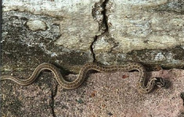

# Russell's Viper / Indian Kukri Snake (`Daboia russelii (cf. Oligodon arnensis)`)

| Field Attribute | Taxonomic / Ecological Specification |
| :--- | :--- |
| **Catalog ID** | `FA-36` |
| **Common Name** | Russell's Viper / Indian Kukri Snake |
| **Scientific Name** | *Daboia russelii (cf. Oligodon arnensis)* |
| **Family** | `Viperidae / Colubridae` |
| **Order** | `Squamata (Lizards & Snakes)` |
| **Taxonomic Guild** | Reptiles |
| **Location of Observation** | **Dry Scrub & Rocky Embankments** |
| **Microhabitat** | Dry scrub, grass margins, and rocky ground crevices |
| **Trophic Level** | Tertiary Consumer / Carnivore (Trophic Level 4) |
| **Contributing Survey Team** | **Team Shatmika** |
| **Survey Source** | Assignment 2 Survey (Team Shatmika) |

---

## Field Observation Photograph

---

## Zoological & Morphological Description

Slender to stout-bodied serpent featuring distinct geometric chevron occipital markings and mottled dorsal patterning adapted for cryptic camouflage in leaf litter.

---

## Ecological Role & Campus Interactions

- **Trophic Level**: Tertiary Consumer / Carnivore (Trophic Level 4)
- **Ecosystem Service**: Solitary nocturnal serpentine predator that controls rodent, frog, and lizard populations across campus peripheral scrub belts.
- **Campus Food Web Dynamics**:
  - Participates actively in predator-prey or plant-pollinator networks across campus zones.
  - Contributes to population regulation, seed dispersal, or detrital soil nutrient cycling.

---

[Back to Fauna Index](../README.md) | [Back to Campus Inventory Root](../../README.md)
