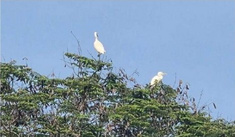

# Western Cattle Egret (`Bubulcus ibis (syn. Ardea ibis)`)

| Field Attribute | Taxonomic / Ecological Specification |
| :--- | :--- |
| **Catalog ID** | `FA-37` |
| **Common Name** | Western Cattle Egret |
| **Scientific Name** | *Bubulcus ibis (syn. Ardea ibis)* |
| **Family** | `Ardeidae` |
| **Order** | `Pelecaniformes (Herons & Egrets)` |
| **Taxonomic Guild** | Birds (Avifauna) |
| **Location of Observation** | **Campus Lawns & Sports Ground Borders** |
| **Microhabitat** | Open mown lawns, sports grounds, perimeter wetlands |
| **Trophic Level** | Tertiary Consumer / Carnivorous Predator (Trophic Level 3-4) |
| **Contributing Survey Team** | **Team Shatmika** |
| **Survey Source** | Assignment 2 Survey (Team Shatmika) |

---

## Field Observation Photograph

---

## Zoological & Morphological Description

Compact white heron with a stout yellow bill, dark legs, and during breeding season, rich golden-buff plumes on the crown, neck, and back.

---

## Ecological Role & Campus Interactions

- **Trophic Level**: Tertiary Consumer / Carnivorous Predator (Trophic Level 3-4)
- **Ecosystem Service**: Gregarious terrestrial heron that stalks across open lawns feeding on disturbed grasshoppers, frogs, crickets, and worms, regulating lawn pest populations.
- **Campus Food Web Dynamics**:
  - Participates actively in predator-prey or plant-pollinator networks across campus zones.
  - Contributes to population regulation, seed dispersal, or detrital soil nutrient cycling.

---

[Back to Fauna Index](../README.md) | [Back to Campus Inventory Root](../../README.md)
