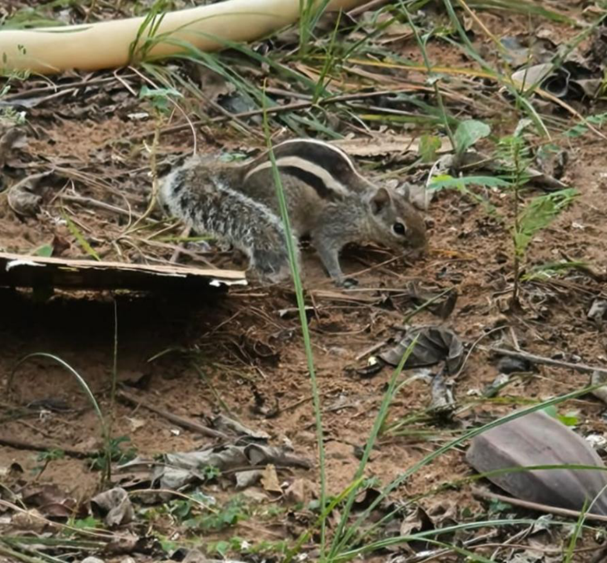

# Indian Palm Squirrel / Three-striped Palm Squirrel (`Funambulus palmarum`)

| Field Attribute | Taxonomic / Ecological Specification |
| :--- | :--- |
| **Catalog ID** | `FA-38` |
| **Common Name** | Indian Palm Squirrel / Three-striped Palm Squirrel |
| **Scientific Name** | *Funambulus palmarum* |
| **Family** | `Sciuridae` |
| **Order** | `Rodentia (Rodents)` |
| **Taxonomic Guild** | Mammals |
| **Location of Observation** | **Campus Temple & Tree Canopies** |
| **Microhabitat** | Tree trunks, garden walls, ground leaf litter, building eaves |
| **Trophic Level** | Primary/Secondary Consumer & Granivore-Frugivore (Trophic Level 2-3) |
| **Contributing Survey Team** | **Team Sasthika** |
| **Survey Source** | Assignment 2 Survey (Team Sasthika - Team 33) |

---

## Field Observation Photograph

---

## Zoological & Morphological Description

Small bushy-tailed squirrel with three distinctive creamy-white longitudinal stripes along its grizzled greyish-brown back. Renowned for its high-pitched bird-like alarm call.

---

## Ecological Role & Campus Interactions

- **Trophic Level**: Primary/Secondary Consumer & Granivore-Frugivore (Trophic Level 2-3)
- **Ecosystem Service**: Highly agile diurnal arboreal squirrel that feeds on seeds, nuts, palm fruits, nectar, and small insects. Acts as an important campus seed disperser and occasional pollinator.
- **Campus Food Web Dynamics**:
  - Participates actively in predator-prey or plant-pollinator networks across campus zones.
  - Contributes to population regulation, seed dispersal, or detrital soil nutrient cycling.

---

[⬅ Back to Fauna Index](../README.md) | [🏠 Back to Campus Inventory Root](../../README.md)
