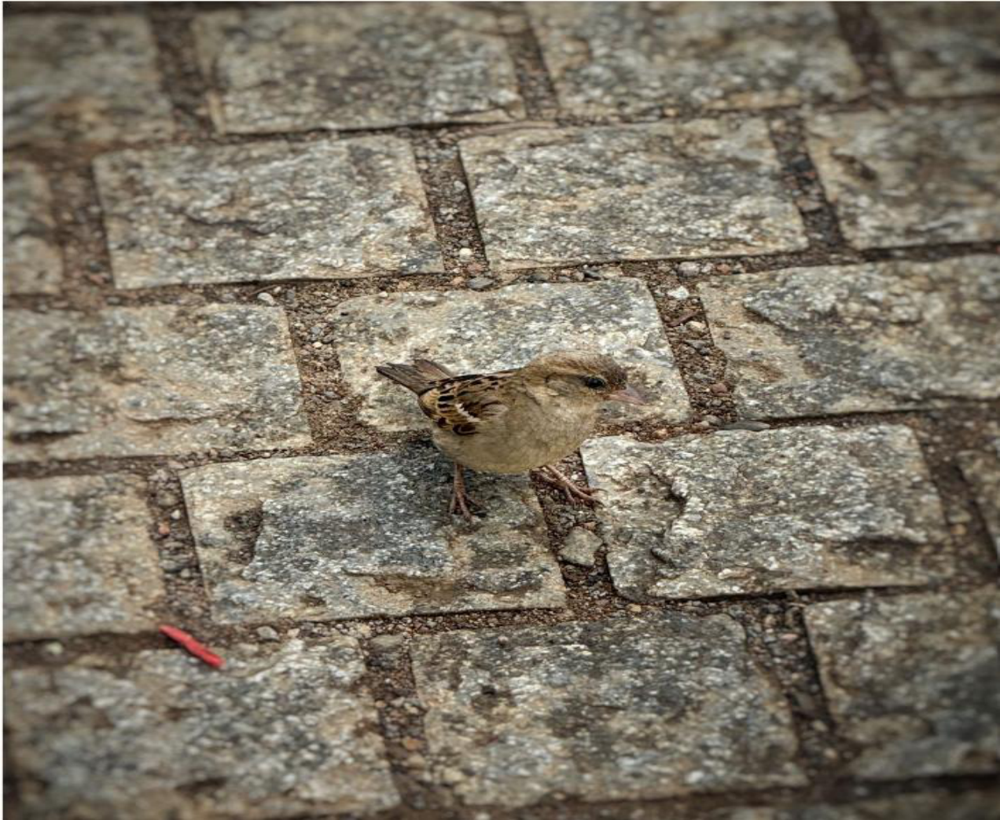

# House Sparrow (`Passer domesticus`)

| Field Attribute | Taxonomic / Ecological Specification |
| :--- | :--- |
| **Catalog ID** | `FA-39` |
| **Common Name** | House Sparrow |
| **Scientific Name** | *Passer domesticus* |
| **Family** | `Passeridae` |
| **Order** | `Passeriformes (Perching Birds)` |
| **Taxonomic Guild** | Birds (Avifauna) |
| **Location of Observation** | **Campus Temple & Courtyard Pavements** |
| **Microhabitat** | Anthropogenic structures, temple eaves, paved courtyards |
| **Trophic Level** | Primary/Secondary Consumer & Granivore-Insectivore (Trophic Level 2-3) |
| **Contributing Survey Team** | **Team Sasthika** |
| **Survey Source** | Assignment 2 Survey (Team Sasthika - Team 33) |

---

## Field Observation Photograph

---

## Zoological & Morphological Description

Compact, stout seed-eating passerine. Males feature a bold grey crown, chestnut neck, and black throat bib; females are soft sandy-brown with a distinct buff supercilium.

---

## Ecological Role & Campus Interactions

- **Trophic Level**: Primary/Secondary Consumer & Granivore-Insectivore (Trophic Level 2-3)
- **Ecosystem Service**: Iconic urban passerine that thrives near human habitation, gleaning grass seeds and discarded food scraps while feeding insect larvae to its chicks, providing natural garden pest control.
- **Campus Food Web Dynamics**:
  - Participates actively in predator-prey or plant-pollinator networks across campus zones.
  - Contributes to population regulation, seed dispersal, or detrital soil nutrient cycling.

---

[Back to Fauna Index](../README.md) | [Back to Campus Inventory Root](../../README.md)
