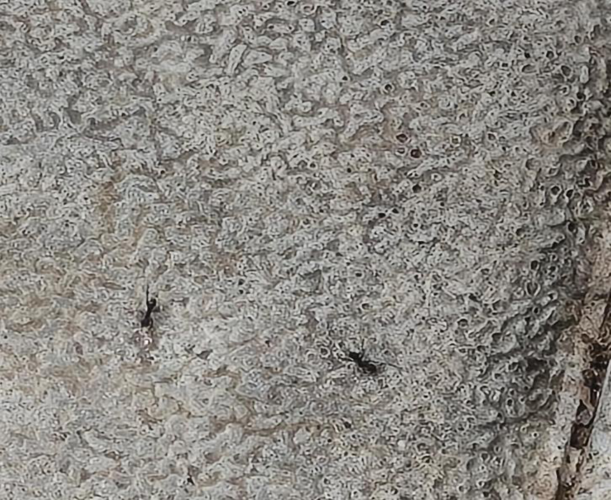

# Black Crazy Ant / Longhorn Ant (`Paratrechina longicornis`)

| Field Attribute | Taxonomic / Ecological Specification |
| :--- | :--- |
| **Catalog ID** | `FA-40` |
| **Common Name** | Black Crazy Ant / Longhorn Ant |
| **Scientific Name** | *Paratrechina longicornis* |
| **Family** | `Formicidae` |
| **Order** | `Hymenoptera (Wasps, Bees, Ants)` |
| **Taxonomic Guild** | Insects / Arthropods |
| **Location of Observation** | **Campus Temple & Stone Pathways** |
| **Microhabitat** | Tree trunks, stone pavements, soil crevices near gardens |
| **Trophic Level** | Secondary Consumer / Scavenger & Generalist Predator (Trophic Level 2-3) |
| **Contributing Survey Team** | **Team Sasthika** |
| **Survey Source** | Assignment 2 Survey (Team Sasthika - Team 33) |

---

## Field Observation Photograph

---

## Zoological & Morphological Description

Slender dark brown to black ant with extraordinarily long 12-segmented antennae and long legs, exhibiting characteristically rapid and jerky zigzag locomotion.

---

## Ecological Role & Campus Interactions

- **Trophic Level**: Secondary Consumer / Scavenger & Generalist Predator (Trophic Level 2-3)
- **Ecosystem Service**: Ubiquitous social insect that moves in erratic, rapid darting patterns ('crazy ant'). Scavenges dead invertebrates, tends aphids and scale insects for honeydew, and cleans micro-organic campus debris.
- **Campus Food Web Dynamics**:
  - Participates actively in predator-prey or plant-pollinator networks across campus zones.
  - Contributes to population regulation, seed dispersal, or detrital soil nutrient cycling.

---

[⬅ Back to Fauna Index](../README.md) | [🏠 Back to Campus Inventory Root](../../README.md)
