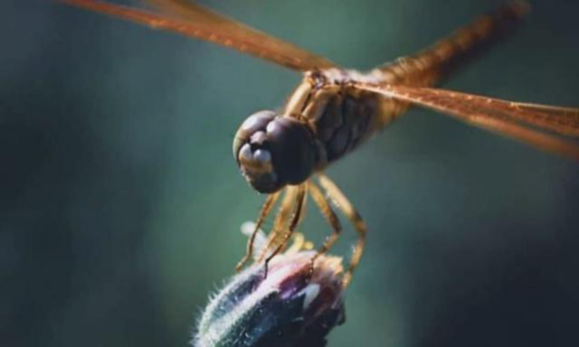

# Wandering Glider Dragonfly (`Pantala flavescens`)

| Field Attribute | Taxonomic / Ecological Specification |
| :--- | :--- |
| **Catalog ID** | `FA-43` |
| **Common Name** | Wandering Glider Dragonfly / Globe Skimmer |
| **Scientific Name** | *Pantala flavescens* |
| **Family** | `Libellulidae` |
| **Order** | `Odonata (Dragonflies & Damselflies)` |
| **Category** | Insect (Dragonfly / Libellulidae) |
| **Taxonomic Guild** | **Insects / Arthropods** |
| **Location of Observation** | **CSE block** |
| **Microhabitat** | Open airspace, shrub borders, flight paths near flowering hedges |
| **Trophic Level** | Secondary Consumer / Aerial Predator (Trophic Level 3) |
| **Contributing Survey Team** | **Team Saravanan** |
| **Survey Source** | Assignment 2 Survey (Team Saravanan) |

---

## Field Observation Photograph

  

---

## Zoological & Morphological Description

A cosmopolitan, highly migratory dragonfly with a yellowish to reddish-ochre abdomen, clear translucent wings with yellowish-amber tinges near the base, and distinctive reddish pterostigmata. Observed captured in mid-flight approaching flower buds, showcasing agile aerial hovering and hawking locomotion.

---

## Ecological Role & Campus Interactions

- **Trophic Level**: Secondary Consumer / Aerial Predator (Trophic Level 3)
- **Ecosystem Service**: Active aerial predator that feeds continuously on mosquitoes, gnats, midges, termites, and small flying agricultural/garden pests, providing vital biological insect control around campus academic blocks.
- **Position in Food Web**:
  - Preys upon dipterans (mosquitoes), small moths, and aphids.
  - Serves as prey for insectivorous avifauna (such as *Dicrurus macrocercus* - Black Drongo) and garden lizards (*Calotes versicolor*).

---

[⬅ Back to Fauna Index](../README.md) | [🏠 Back to Campus Inventory Root](../../README.md)
