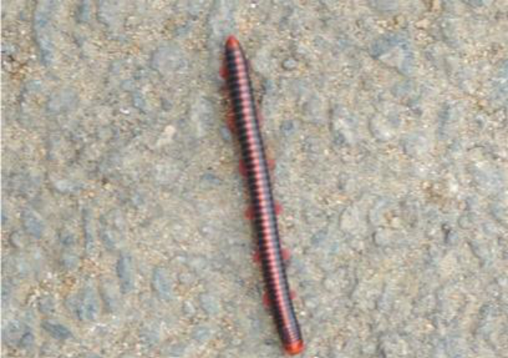

# Rusty Millipede (`Trigoniulus corallinus`)

| Field Attribute | Taxonomic / Ecological Specification |
| :--- | :--- |
| **Catalog ID** | `FA-44` |
| **Common Name** | Rusty Millipede / Asian Millipede |
| **Scientific Name** | *Trigoniulus corallinus* |
| **Family** | `Trigoniulidae` |
| **Order** | `Spirobolida (Round-backed Millipedes)` |
| **Category** | Arthropod (Diplopoda / Spirobolida) |
| **Taxonomic Guild** | **Myriapods / Arthropods** |
| **Location of Observation** | **Rishabhs** |
| **Microhabitat** | Damp leaf litter, shaded ground, moist concrete margins, soil humus |
| **Trophic Level** | Primary Consumer / Primary Detritivore & Decomposer (Trophic Level 2) |
| **Contributing Survey Team** | **Team Saravanan** |
| **Survey Source** | Assignment 2 Survey (Team Saravanan) |

---

## Field Observation Photograph

  

---

## Zoological & Morphological Description

A cylindrical, reddish-brown to brick-red banded millipede with dark segmental rings and numerous pairs of walking legs (two pairs per diplosegment). Demonstrates slow, deliberate burrowing locomotion through leaf litter and coils into a protective spiral (volvation) when disturbed.

---

## Ecological Role & Campus Interactions

- **Trophic Level**: Primary Consumer / Primary Detritivore (Trophic Level 2)
- **Ecosystem Service**: Indispensable macro-decomposer in campus leaf-litter ecosystems. Consumes decaying fallen leaves, fibrous mulch, and organic plant debris, accelerating humification, aerating surface soil layers, and recycling essential soil nutrients.
- **Position in Food Web**:
  - Acts alongside *Xenobolus carnifex* (Red-Headed Millipede) as the primary macro-invertebrate detrital breakdown agent.
  - Serves as prey or secondary forage for ground-gleaning birds such as the Yellow-billed Babbler (*Argya affinis*) and omnivorous top foragers.

---

[Back to Fauna Index](../README.md) | [Back to Campus Inventory Root](../../README.md)
