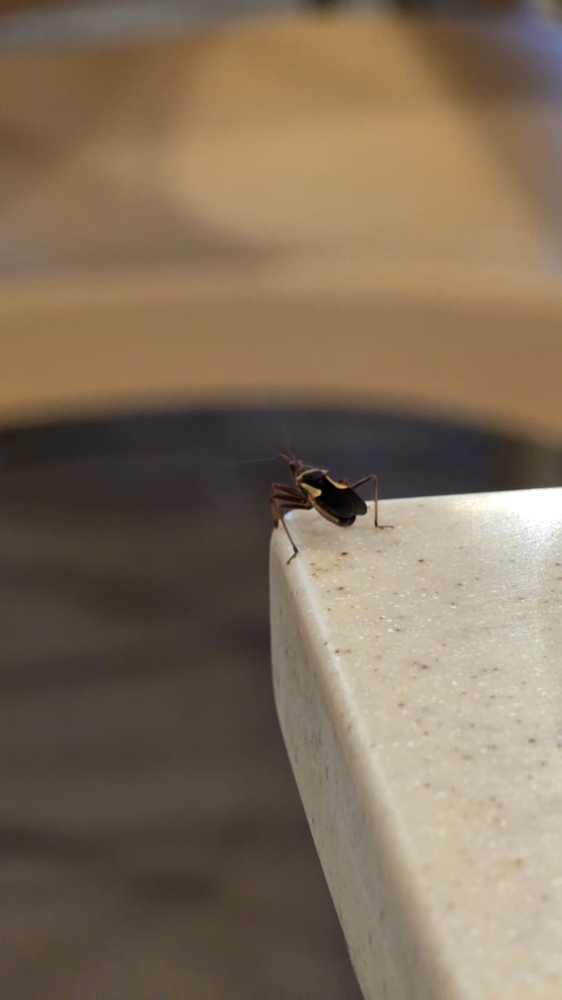

# Yellow-spotted Assassin Bug (`Acanthaspis quinquespinosa`)

| Field Attribute | Taxonomic / Ecological Specification |
| :--- | :--- |
| **Catalog ID** | `FA-45` |
| **Common Name** | Yellow-spotted Assassin Bug / Corsair Bug |
| **Scientific Name** | *Acanthaspis quinquespinosa* |
| **Family** | `Reduviidae` |
| **Order** | `Hemiptera (True Bugs)` |
| **Category** | Insect (True Bug / Reduviidae) |
| **Taxonomic Guild** | **Insects / Arthropods** |
| **Location of Observation** | **Gents Hostel 8** |
| **Microhabitat** | Outdoor wall surfaces near light fixtures, leaf litter, concrete crevices |
| **Trophic Level** | Secondary Consumer / Predatory Insect (Trophic Level 3) |
| **Contributing Survey Team** | **Team Yagna Sanjeev** |
| **Survey Source** | Assignment 2 Survey (Team Yagna Sanjeev) |

---

## Field Observation Photograph

  

---

## Zoological & Morphological Description

A predatory reduviid true bug characterized by a dark brown-to-black body accented by five distinct yellow-orange spots on the hemelytra and pronotum. Equipped with a stout 3-segmented curved rostrum (proboscis) and raptorial forelegs designed to grasp and paralyze invertebrate prey.

---

## Ecological Role & Campus Interactions

- **Trophic Level**: Secondary Consumer / Predatory Insect (Trophic Level 3)
- **Ecosystem Service**: Active nocturnal predator regulating campus insect pest populations. Preys on termites, cockroaches, caterpillars, and beetles by piercing their exoskeleton and injecting digestive enzymes.
- **Position in Food Web**:
  - Controls lower-trophic herbivores and detritivores near residential buildings.
  - Serves as prey for nocturnal predators including geckos and predatory arachnids.

---

[Back to Fauna Index](../README.md) | [Back to Campus Inventory Root](../../README.md)
