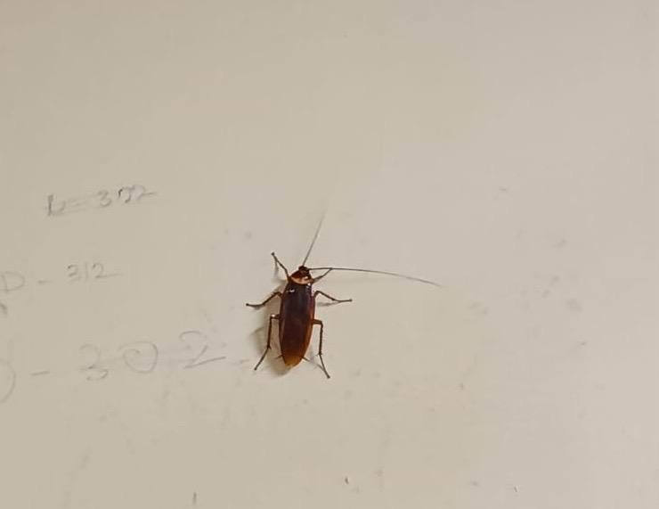

# American Cockroach (`Periplaneta americana`)

| Field Attribute | Taxonomic / Ecological Specification |
| :--- | :--- |
| **Catalog ID** | `FA-46` |
| **Common Name** | American Cockroach |
| **Scientific Name** | *Periplaneta americana* |
| **Family** | `Blattidae` |
| **Order** | `Blattodea (Cockroaches)` |
| **Category** | Insect (Cockroach / Blattidae) |
| **Taxonomic Guild** | **Insects / Arthropods** |
| **Location of Observation** | **Gents Hostel 4** |
| **Microhabitat** | Moist utility conduits, shaded drains, basement perimeters, outdoor floor margins |
| **Trophic Level** | Primary / Secondary Consumer & Detritivore (Trophic Level 2-3) |
| **Contributing Survey Team** | **Team Yagna Sanjeev** |
| **Survey Source** | Assignment 2 Survey (Team Yagna Sanjeev) |

---

## Field Observation Photograph

  

---

## Zoological & Morphological Description

A large reddish-brown blattid insect with long filiform antennae, flattened oval body, and a yellowish pale band around the edge of the pronotum. Demonstrates high cursorial speed and negative phototaxis, sheltering in damp secluded crevices during daylight hours.

---

## Ecological Role & Campus Interactions

- **Trophic Level**: Primary Consumer / Detritivore & Decomposer (Trophic Level 2)
- **Ecosystem Service**: Highly adaptable generalist scavenger that breaks down decaying organic matter, fallen food debris, and cellulose, returning organic nutrients to urban micro-soils.
- **Position in Food Web**:
  - Consumes fallen organic detritus and decaying organic plant debris.
  - Forms a crucial high-protein food resource for campus predators including the Yellow-spotted Assassin Bug (*Acanthaspis quinquespinosa*), Oriental Garden Lizard (*Calotes versicolor*), and Domestic Cat (*Felis catus*).

---

[Back to Fauna Index](../README.md) | [Back to Campus Inventory Root](../../README.md)
