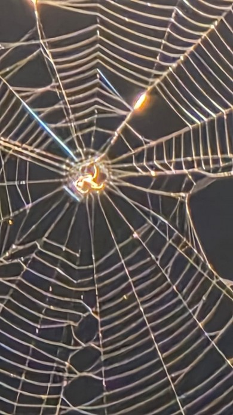

# Common Orb-weaver Spider (`Neoscona sp.`)

| Field Attribute | Taxonomic / Ecological Specification |
| :--- | :--- |
| **Catalog ID** | `FA-47` |
| **Common Name** | Common Orb-weaver Spider / Barn Spider |
| **Scientific Name** | *Neoscona sp. (syn. Araneus sp.)* |
| **Family** | `Araneidae` |
| **Order** | `Araneae (Spiders)` |
| **Category** | Arachnid (Orb-weaving Spider / Araneidae) |
| **Taxonomic Guild** | **Spiders (Araneae)** |
| **Location of Observation** | **Gents Hostel 2** |
| **Microhabitat** | Garden shrubs, exterior building corridors, eave frameworks near illumination |
| **Trophic Level** | Secondary Consumer / Carnivorous Predator (Trophic Level 3) |
| **Contributing Survey Team** | **Team Yagna Sanjeev** |
| **Survey Source** | Assignment 2 Survey (Team Yagna Sanjeev) |

---

## Field Observation Photograph

  

---

## Zoological & Morphological Description

An orb-weaving spider characterized by a globular hairy abdomen with subtle geometric leaf-like patterns and banded legs. Specializes in building classic vertical orb webs of concentric sticky silk spirals positioned across flight paths to intercept nocturnal flying insects.

---

## Ecological Role & Campus Interactions

- **Trophic Level**: Secondary Consumer / Invertebrate Predator (Trophic Level 3)
- **Ecosystem Service**: Essential biocontrol agent around residential hostel blocks. Intercepts and consumes nocturnal flying insects including mosquitoes (*Culex sp.*), gnats, moths, and midges.
- **Position in Food Web**:
  - Traps herbivorous and detritivorous insects in its aerial webs.
  - Consumed by insectivorous birds such as the Jungle Babbler (*Argya striata*) and predatory mud-dauber/paper wasps (*Ropalidia marginata*).

---

[Back to Fauna Index](../README.md) | [Back to Campus Inventory Root](../../README.md)
