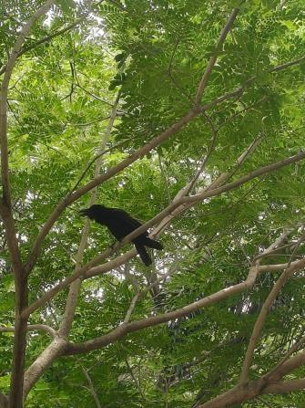

# Indian Jungle Crow (`Corvus culminatus`)

| Field Attribute | Taxonomic / Ecological Specification |
| :--- | :--- |
| **Catalog ID** | `FA-48` |
| **Common Name** | Indian Jungle Crow / Large-billed Crow |
| **Scientific Name** | *Corvus culminatus* |
| **Family** | `Corvidae` |
| **Order** | `Passeriformes (Perching Birds)` |
| **Category** | Bird (Avifauna / Corvidae) |
| **Taxonomic Guild** | **Birds (Avifauna)** |
| **Location of Observation** | **Zone C — Admin Block Surrounds** |
| **Microhabitat** | Perched in mature Gulmohar (*Delonix regia*) tree canopy |
| **Trophic Level** | Tertiary Consumer / Scavenger & Top Omnivore (Trophic Level 4-5) |
| **Contributing Survey Team** | **Team Venkatadri** |
| **Survey Source** | Assignment 2 Survey (Team Venkatadri) |

---

## Field Observation Photograph

  

---

## Zoological & Morphological Description

A robust, entirely glossy black corvid distinguished from the House Crow by its heavier arched black bill, uniform raven-black plumage with purplish-blue gloss, deep resonant 'kow-kow' vocalization, and absence of a grey neck collar.

---

## Ecological Role & Campus Interactions

- **Trophic Level**: Tertiary Consumer & Omnivorous Scavenger (Trophic Level 4-5)
- **Ecosystem Service**: Keystone campus scavenger that removes animal refuse, dead organic matter, and scraps, while opportunistically hunting lizards (*Calotes versicolor*), garden pests, rodents, and large insects.
- **Position in Food Web**:
  - Apex avian predator in campus lawn and avenue-tree food chains.
  - Regulates reptilian and vertebrate populations while recycling nutrients.

---

[Back to Fauna Index](../README.md) | [Back to Campus Inventory Root](../../README.md)
