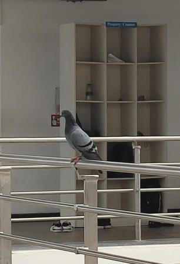

# Rock Pigeon (`Columba livia`)

| Field Attribute | Taxonomic / Ecological Specification |
| :--- | :--- |
| **Catalog ID** | `FA-49` |
| **Common Name** | Rock Pigeon / Blue Rock Dove / Feral Pigeon |
| **Scientific Name** | *Columba livia* |
| **Family** | `Columbidae` |
| **Order** | `Columbiformes (Pigeons & Doves)` |
| **Category** | Bird (Avifauna / Columbidae) |
| **Taxonomic Guild** | **Birds (Avifauna)** |
| **Location of Observation** | **Zone C — Academic Block Corridor** |
| **Microhabitat** | Building ledges, open architectural corridors, stairwell railings |
| **Trophic Level** | Primary Consumer / Granivore & Frugivore (Trophic Level 2) |
| **Contributing Survey Team** | **Team Venkatadri** |
| **Survey Source** | Assignment 2 Survey (Team Venkatadri) |

---

## Field Observation Photograph

  

---

## Zoological & Morphological Description

A stout-bodied grey columbid with iridescent greenish-purple sheen around the neck, two distinct black bars across the inner wings, a broad black terminal band on the tail, and pink feet. Highly synanthropic species adapted to nesting on vertical artificial cliffs (academic building ledges).

---

## Ecological Role & Campus Interactions

- **Trophic Level**: Primary Consumer / Granivore (Trophic Level 2)
- **Ecosystem Service**: Efficient seed disperser and granivore that gleans fallen seeds, grains, and weed fruit from lawns and paved campus paths.
- **Position in Food Web**:
  - Primary seed consumer in urban built micro-zones.
  - Acts as a potential prey resource for domestic cats (*Felis catus*) and raptors.

---

[Back to Fauna Index](../README.md) | [Back to Campus Inventory Root](../../README.md)
