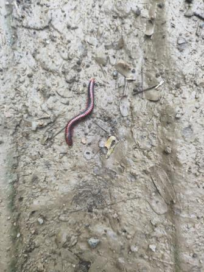

# Flat-backed Millipede (`Anoplodesmus sp.`)

| Field Attribute | Taxonomic / Ecological Specification |
| :--- | :--- |
| **Catalog ID** | `FA-50` |
| **Common Name** | Flat-backed Millipede / Paradoxosomatid Millipede |
| **Scientific Name** | *Anoplodesmus sp.* |
| **Family** | `Paradoxosomatidae` |
| **Order** | `Polydesmida (Flat-backed Millipedes)` |
| **Category** | Arthropod (Diplopoda / Polydesmida) |
| **Taxonomic Guild** | **Myriapods / Arthropods** |
| **Location of Observation** | **Zone E — Gents Hostel Link Road** |
| **Microhabitat** | Moist shaded soil surface beneath Neem leaf litter |
| **Trophic Level** | Primary Consumer / Primary Detritivore & Decomposer (Trophic Level 2) |
| **Contributing Survey Team** | **Team Venkatadri** |
| **Survey Source** | Assignment 2 Survey (Team Venkatadri) |

---

## Field Observation Photograph

  

---

## Zoological & Morphological Description

A terrestrial polydesmid millipede characterized by distinct lateral wing-like keels (paranota) giving the body a flattened profile. Dark brownish-black dorsum with lighter yellowish-tan paranota margins, emerging actively onto damp soil and paved margins following rainfall.

---

## Ecological Role & Campus Interactions

- **Trophic Level**: Primary Consumer / Primary Detritivore (Trophic Level 2)
- **Ecosystem Service**: Indispensable decomposer of damp deciduous leaf litter along hostel roads. Breaks down tough cellulose and lignin, returning vital nitrogen and minerals to the soil.
- **Position in Food Web**:
  - Forms the foundational detrital consumer link in Food Chain 2 of the campus shaded margins.
  - Prey resource for ground spiders (*Araneae*) and insectivorous garden lizards (*Calotes versicolor*).

---

[Back to Fauna Index](../README.md) | [Back to Campus Inventory Root](../../README.md)
