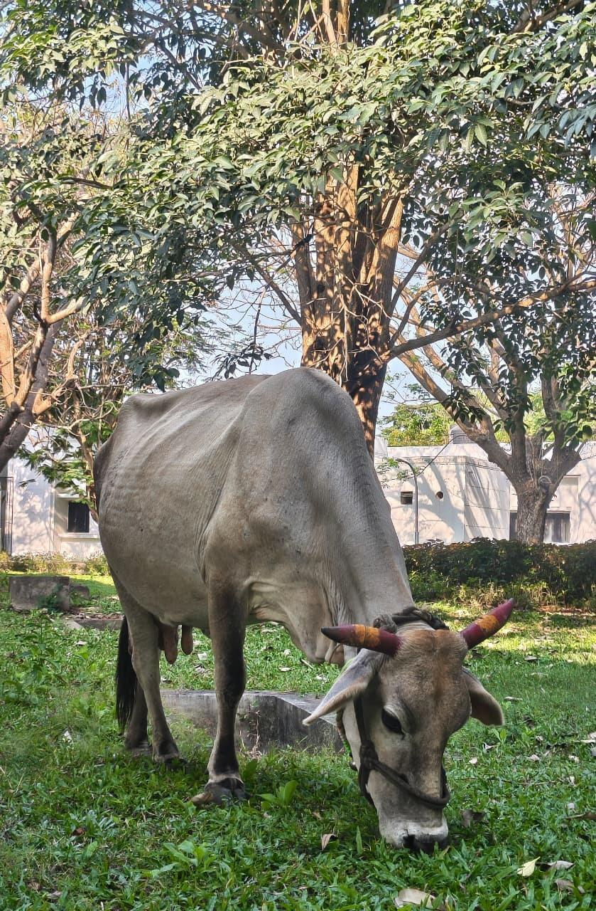

# Domestic Cattle / Zebu Cow (`Bos taurus`)

| Field Attribute | Taxonomic / Ecological Specification |
| :--- | :--- |
| **Catalog ID** | `FA-51` |
| **Common Name** | Domestic Cattle / Zebu Cow / Cow |
| **Scientific Name** | *Bos taurus (cf. Bos indicus)* |
| **Family** | `Bovidae` |
| **Order** | `Artiodactyla (Even-toed Ungulates)` |
| **Category** | Mammal (Herbivorous Ungulate / Bovidae) |
| **Taxonomic Guild** | **Mammals** |
| **Location of Observation** | **Near JP Auditorium** |
| **Microhabitat** | Grassy open meadows, shaded lawn margins near Auditorium |
| **Trophic Level** | Primary Consumer / Large Herbivorous Grazer (Trophic Level 2) |
| **Contributing Survey Team** | **Team Thuliyan** |
| **Survey Source** | Assignment 2 Survey (Team Thuliyan) |

---

## Field Observation Photograph

  

---

## Zoological & Morphological Description

Large domesticated ruminant ungulate adapted to tropical climates, exhibiting short greyish-tan coat, prominent shoulder hump characteristic of zebu heritage, dewlap along the throat, and curved horns. A placid diurnal grazer observed grazing freely on campus grass lawns.

---

## Ecological Role & Campus Interactions

- **Trophic Level**: Primary Consumer / Herbivore & Grazer (Trophic Level 2)
- **Ecosystem Service**: Natural lawn mower and herbivore that crops tall campus grasses, controls overgrown turf vegetation, and deposits organic manure that enriches soil micro-fauna and nourishes dung beetles and detritivores.
- **Position in Food Web**:
  - Consumes primary producer biomass (*Cynodon dactylon*, weeds, and low foliage).
  - Interacts with commensal birds like the Western Cattle Egret (*Bubulcus ibis*) and House Crow (*Corvus splendens*) which forage on insects flushed by its grazing.

---

[Back to Fauna Index](../README.md) | [Back to Campus Inventory Root](../../README.md)
